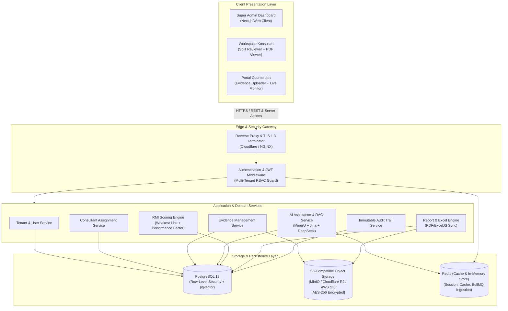
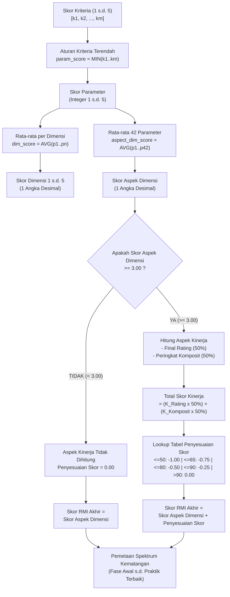

# System Architecture Document (SAD)
# OpenRMI — Multi-Tenant Enterprise Risk Maturity Assessment Platform

---

## 1. Ringkasan Arsitektur & Prinsip Desain

Dokumen ini mendefinisikan arsitektur teknis sistem **OpenRMI**, platform B2B Software-as-a-Service (SaaS) multi-tenant untuk penilaian dan pemantauan tingkat kematangan risiko (*Risk Maturity Index*) BUMN berdasarkan regulasi Kementerian BUMN (Permen No. PER-2/MBU/03/2023 dan Juknis 8 Per-2 BUMN 2023).

### 1.1 Prinsip Arsitektur Utama
1. **Multi-Tenancy yang Aman (*Strict Data Isolation*)**:
   Menggunakan model basis data bersama (*Shared Database, Shared Schema*) dengan pengamanan berbasis **Row-Level Security (RLS)** pada PostgreSQL. Data antar-perusahaan (tenant) terisolasi secara mutlak.
2. **Kemandirian Domain & Modularitas (*Clean Architecture*)**:
   Pemisahan tegas antara Presentation Layer, Application/API Services, Domain Business Logic (khususnya *Scoring Engine* RMI), dan Persistence Layer.
3. **Integritas Kalkulasi & Regulasi (*Deterministic Scoring*)**:
   Mesin kalkulasi (*Scoring Engine*) bersifat independen, dapat diuji unit (*unit tested*) secara deterministik, dan menghasilkan skor yang 100% identik dengan standar lembar kerja resmi `SCORE RMI.xlsx`.
4. **Jejak Audit Kekal (*Immutable Audit Trail*)**:
   Setiap interaksi penilaian (perubahan skor, unggah berkas bukti, catatan reviu kriteria) dicatat secara append-only untuk kepatuhan tata kelola korporasi.

---

## 2. Diagram Arsitektur Tingkat Tinggi (High-Level Architecture)



---

## 3. Rekomendasi Tumpukan Teknologi (Technology Stack)

| Lapisan Sistem | Teknologi Rekomendasi | Justifikasi Pemilihan |
| :--- | :--- | :--- |
| **Frontend Framework** | **Next.js 14+ (App Router, React 19, TypeScript)** | Performa tinggi, Server-Side Rendering untuk dashboard eksekutif, Client Component untuk workspace reviu interaktif. |
| **Styling & UI Library** | **Tailwind CSS + Shadcn UI (Radix Primitives)** | Desain sistem enterprise konsisten, komponen modular dengan aksesibilitas tinggi (a11y). |
| **State & Data Fetching** | **TanStack React Query + Zustand** | Manajemen cache lokal untuk reviu dokumen real-time dan optimasi rendering tabel 42 parameter. |
| **Document/PDF Viewer** | **PDF.js / React-PDF** | Pratinjau instan dokumen bukti (PDF, PNG, JPG) di panel drawer samping tanpa unduh manual. |
| **Backend & API Layer** | **Express.js (Node.js + Express.js + TypeScript)** | Arsitektur RESTful API modular, middleware fleksibel untuk Multi-Tenant RLS & RBAC, serta ekosistem library kaya untuk ekspor dokumen (ExcelJS, Puppeteer). |
| **ORM & Database Client** | **Prisma ORM** | Type-safety penuh, migrasi skema otomatis, dan integrasi mudah dengan PostgreSQL RLS. |
| **Database Mesin & Vector**| **PostgreSQL 18 + `pgvector`** | Mendukung *Row-Level Security (RLS)* native, performa query terindeks, dan penyimpanan vektor embedding terisolasi per tenant. |
| **Document Parser (PDF)** | **MinerU (Magic-PDF)** | Ekstraksi presisi tinggi untuk dokumen PDF/Word/Excel (struktur heading, paragraf, tabel, dan metadata nomor halaman asli). |
| **Embedding Engine** | **Jina Embeddings (v2/v3)** | Model embedding multimodal/teks 8192-token context length dengan akurasi semantik tinggi untuk regulasi berbahasa Indonesia. |
| **Core Reasoning LLM** | **DeepSeek (DeepSeek-V3 / R1)** | Model penalaran cerdas untuk gap analysis, pencocokan bukti terhadap kriteria Juknis KBUMN, dan rekomendasi skor terjustifikasi. |
| **Penyimpanan Berkas** | **S3-Compatible (MinIO / Cloudflare R2 / S3)** | Penyimpanan dokumen bukti aman terenkripsi AES-256 dengan mekanisme *Presigned URL*. |
| **Cache & Queue** | **Redis (Cache & In-Memory Store) + BullMQ** | Caching query/respons data, sesi JWT, rate limiting, dan antrean ingestion RAG (MinerU + Jina) serta pembuatan laporan PDF/Excel. |

---

## 4. Desain Multi-Tenancy & Isolasi Data (Tenant Isolation Strategy)

Sistem menggunakan strategi **Tenant Identifier Pattern** yang ditegakkan pada tingkat basis data menggunakan PostgreSQL Row-Level Security (RLS).

```
                            DATABASE QUERY ENGINE
                                     │
                 ┌───────────────────┴───────────────────┐
                 ▼                                       ▼
       [ SUPER_ADMIN ROLE ]                     [ TENANT ROLES ]
     RLS: BYPASSRLS = TRUE                 SET LOCAL app.current_tenant_id = 'xxx'
(Akses Global Lintas Perusahaan)                         │
                                           ┌─────────────┴─────────────┐
                                           ▼                           ▼
                              [ TIM COUNTERPART ]             [ KONSULTAN EKSTERNAL ]
                           WHERE tenant_id = 'xxx'             WHERE tenant_id = 'xxx'
                                                               AND EXISTS (assignment)
```

### 4.1 Kebijakan Row-Level Security (RLS DDL)

Setiap tabel yang berelasi dengan data perusahaan memiliki kolom `tenant_id UUID NOT NULL REFERENCES tenants(id)`.

```sql
-- Mengaktifkan RLS pada tabel bukti dokumen
ALTER TABLE criterion_evidences ENABLE ROW LEVEL SECURITY;

-- Kebijakan akses untuk Tim Counterpart (Hanya tenant miliknya)
CREATE POLICY counterpart_tenant_isolation ON criterion_evidences
    FOR ALL
    TO authenticated_user
    USING (
        tenant_id = NULLIF(current_setting('app.current_tenant_id', true), '')::UUID
    );

-- Kebijakan akses untuk Konsultan Eksternal (Hanya tenant yang ditugaskan secara sah)
CREATE POLICY consultant_assignment_access ON criterion_evidences
    FOR SELECT
    TO authenticated_user
    USING (
        EXISTS (
            SELECT 1 FROM consultant_assignments ca
            WHERE ca.tenant_id = criterion_evidences.tenant_id
              AND ca.consultant_id = NULLIF(current_setting('app.current_user_id', true), '')::UUID
              AND ca.is_active = TRUE
        )
    );
```

---

## 5. Spesifikasi Mesin Kalkulasi (RMI Scoring Engine Architecture)

Mesin kalkulasi RMI dipisahkan sebagai modul logika murni (*Pure Business Domain Service*) untuk menjamin determinisme dan kemudahan pengujian unit (*100% test coverage*).

### 5.1 Diagram Alur Kalkulasi RMI



### 5.2 Implementasi Logika Scoring Engine (TypeScript Domain Service)

```typescript
// backend/src/modules/scoring/calculator.ts

export interface CriterionInput {
  criterionCode: string;
  score: number; // 1, 2, 3, 4, 5
}

export interface PerformanceInput {
  finalRating: 'AAA' | 'AA' | 'A' | 'BBB' | 'BB' | 'B' | 'CCC' | 'CC' | 'C';
  compositeRiskRating: 1 | 2 | 3 | 4 | 5;
}

export const RATING_CONVERSION: Record<string, number> = {
  AAA: 100, AA: 90, A: 79, BBB: 67, BB: 56, B: 44, CCC: 33, CC: 21, C: 10,
};

export const COMPOSITE_CONVERSION: Record<number, number> = {
  1: 100, 2: 78, 3: 55, 4: 33, 5: 10,
};

export class RmiScoringEngine {
  /**
   * Menghitung skor parameter berdasarkan kriteria terendah (Weakest-Link Rule)
   */
  public static calculateParameterScore(criteria: CriterionInput[]): number {
    if (!criteria || criteria.length === 0) return 0;
    const scores = criteria.map(c => Math.floor(c.score));
    return Math.min(...scores);
  }

  /**
   * Menghitung rata-rata skor dimensi
   */
  public static calculateDimensionScore(parameterScores: number[]): number {
    if (!parameterScores.length) return 0;
    const sum = parameterScores.reduce((acc, val) => acc + val, 0);
    return Math.round((sum / parameterScores.length) * 10) / 10;
  }

  /**
   * Menghitung penyesuaian skor aspek kinerja berdasarkan gating >= 3.00
   */
  public static calculatePerformanceAdjustment(
    aspectDimScore: number,
    performance?: PerformanceInput
  ): { totalPerfScore: number; adjustment: number; isEligible: boolean } {
    // Klausul Gating: Skor Aspek Dimensi wajib >= 3.00
    if (aspectDimScore < 3.00 || !performance) {
      return { totalPerfScore: 0, adjustment: 0.0, isEligible: false };
    }

    const ratingVal = RATING_CONVERSION[performance.finalRating] ?? 0;
    const compositeVal = COMPOSITE_CONVERSION[performance.compositeRiskRating] ?? 0;

    const totalPerfScore = (ratingVal * 0.5) + (compositeVal * 0.5);

    let adjustment = 0.0;
    if (totalPerfScore <= 50) {
      adjustment = -1.00;
    } else if (totalPerfScore <= 65) {
      adjustment = -0.75;
    } else if (totalPerfScore <= 80) {
      adjustment = -0.50;
    } else if (totalPerfScore <= 90) {
      adjustment = -0.25;
    } else {
      adjustment = 0.00;
    }

    return { totalPerfScore, adjustment, isEligible: true };
  }

  /**
   * Menghitung skor RMI Akhir dan Fase Kematangan
   */
  public static calculateFinalRmi(
    aspectDimScore: number,
    adjustment: number
  ): { finalScore: number; maturityPhase: string } {
    const finalScore = Math.max(1.0, Math.round((aspectDimScore + adjustment) * 10) / 10);

    let maturityPhase = 'Fase Awal';
    if (finalScore >= 5.0) maturityPhase = 'Fase Praktik Terbaik';
    else if (finalScore >= 4.5) maturityPhase = 'Fase Praktik yang Lebih Baik (+)';
    else if (finalScore >= 4.0) maturityPhase = 'Fase Praktik yang Lebih Baik';
    else if (finalScore >= 3.5) maturityPhase = 'Fase Praktik yang Baik (+)';
    else if (finalScore >= 3.0) maturityPhase = 'Fase Praktik yang Baik';
    else if (finalScore >= 2.5) maturityPhase = 'Fase Berkembang (+)';
    else if (finalScore >= 2.0) maturityPhase = 'Fase Berkembang';
    else if (finalScore >= 1.5) maturityPhase = 'Fase Awal (+)';

    return { finalScore, maturityPhase };
  }
}
```

---

### 5.3 Arsitektur RAG & AI Assistance Engine (MinerU + Jina + DeepSeek + pgvector)

Untuk mengoptimalkan efisiensi kerja Konsultan Eksternal dan mencegah pembacaan ulang dokumen secara berulang-ulang (*repetitive document scanning*), OpenRMI menerapkan arsitektur **Retrieval-Augmented Generation (RAG)** cerdas dua tahap:

```
┌────────────────────────────────────────────────────────────────────────┐
│ TAHAP 1: ASYNCHRONOUS INGESTION PIPELINE (Saat Dokumen Di-Upload)      │
├────────────────────────────────────────────────────────────────────────┤
│  Counterpart Upload File (PDF/Docs/XLSX)                               │
│         │                                                              │
│         ▼                                                              │
│  S3 Object Storage (AES-256)                                           │
│         │                                                              │
│         ▼                                                              │
│  BullMQ Queue: 'document.ingestion'                                    │
│         │                                                              │
│         ▼                                                              │
│  MinerU Parser Engine (Magic-PDF)                                      │
│  ├── Ekstraksi teks presisi tinggi, struktur heading & hierarki layout │
│  ├── Pemrosesan tabel regulasi & ekstraksi gambar/stempel              │
│  └── Penandaan nomor halaman asli (page_number metadata)               │
│         │                                                              │
│         ▼                                                              │
│  Semantic Text Chunker (~500 - 800 tokens, 15% overlap)                │
│         │                                                              │
│         ▼                                                              │
│  Jina Embeddings v2/v3 Engine                                          │
│  └── Konversi teks chunk ke dense vector (1024 dimensi semantik)       │
│         │                                                              │
│         ▼                                                              │
│  PostgreSQL 18 (pgvector Storage terisolasi per tenant_id)             │
│  └── Disimpan ke tabel 'document_chunks' dengan HNSW Index             │
└────────────────────────────────────────────────────────────────────────┘

┌────────────────────────────────────────────────────────────────────────┐
│ TAHAP 2: ON-DEMAND AI HELP & REASONING (Saat Asesor Klik "AI Help")    │
├────────────────────────────────────────────────────────────────────────┤
│  Konsultan Eksternal klik tombol "AI Help" pada Parameter P_i          │
│         │                                                              │
│         ▼                                                              │
│  API Backend Express.js: POST /api/v1/consultant/ai-assist/:paramId    │
│         │                                                              │
│         ▼                                                              │
│  Vector Similarity Search (Jina Query Vector <-> pgvector Cosine Dist) │
│  └── Filter mutlak: WHERE tenant_id = current AND period_id = current  │
│  └── Retrieve Top-K Chunks paling relevan (k=8..12) + Page Numbers     │
│         │                                                              │
│         ▼                                                              │
│  DeepSeek LLM Reasoning Core (DeepSeek-V3 / DeepSeek-R1)               │
│  ├── Input: Kriteria Juknis KBUMN + Konteks Eviden Terindeks           │
│  ├── Analisis Kepatuhan & Pendeteksian Celah (Gap Analysis)            │
│  └── Output Terstruktur JSON:                                          │
│      • Rekomendasi skor per kriteria (1..5) & parameter (weakest-link) │
│      • Nomor halaman presisi & kutipan verbatim eviden                 │
│      • Narasi evaluasi reviu dokumen                                   │
│         │                                                              │
│         ▼                                                              │
│  Frontend Asesor: AI Recommendation Drawer                             │
│  └── Asesor Reviu Hasil -> Klik "Terapkan Rekomendasi (One-Click)"     │
│  └── Skor, catatan reviu, dan kutipan langsung mengisi form penilaian │
└────────────────────────────────────────────────────────────────────────┘

┌────────────────────────────────────────────────────────────────────────┐
│ TAHAP 3: CUSTOM AI DOCUMENT ANALYSIS (Dokumen Tambahan Pasca-FGD)      │
├────────────────────────────────────────────────────────────────────────┤
│  1. Tim Counterpart mengunggah "Dokumen Tambahan" (FGD / Klarifikasi)  │
│  2. MinerU + Jina mengekstrak dan mengindeks dokumen per halaman       │
│  3. Konsultan Eksternal membuka dokumen & memasukkan Custom Prompt:    │
│     Contoh: "Apakah dokumen ini memuat klausul sanksi pelanggaran?"    │
│  4. DeepSeek LLM menganalisis dokumen dan menghasilkan output telaah   │
│  5. Hasil analisis disimpan ke tabel 'document_analysis_results'       │
│  6. HAK AKSES KHUSUS: Hanya Konsultan Eksternal yang dapat melihat dan │
│     mengedit catatan hasil analisis ini (Tersembunyi dari Counterpart) │
└────────────────────────────────────────────────────────────────────────┘
```

#### Struktur Kontrak Output Rekomendasi AI (Structured JSON):
```typescript
export interface AiAssistanceResponse {
  parameterId: number;
  parameterCode: string; // P01
  recommendedParameterScore: number; // 1..5 (weakest-link)
  criteriaRecommendations: Array<{
    criterionCode: string; // 'a', 'b', 'c'
    recommendedScore: number; // 1..5
    confidence: 'HIGH' | 'MEDIUM' | 'LOW';
    citations: Array<{
      evidenceId: string;
      fileName: string;
      pageNumber: number;
      exactQuote: string; // Kutipan teks verbatim dari dokumen
      justification: string; // Alasan mengapa eviden memenuhi/belum memenuhi kriteria
    }>;
    gapAnalysis: string; // Kesenjangan yang terdeteksi
  }>;
  summaryRecommendation: string;
}

export interface CustomDocumentAnalysisRequest {
  supplementaryDocId: string;
  customPrompt: string; // Perintah bebas dari asesor
}

export interface CustomDocumentAnalysisResponse {
  analysisId: string;
  supplementaryDocId: string;
  promptGiven: string;
  aiGeneratedAnalysis: string;
  assessorNotes?: string;
  pageReferences: number[];
  modelUsed: string;
  createdAt: string;
}
```

#### Manajemen Konfigurasi AI Terpusat (Super Admin Console):
Seluruh kredensial dan pengaturan model AI disimpan terpusat di tabel basis data `ai_configurations` dan hanya dapat dikelola oleh **Super Admin**:
- `deepseekApiKey`: Kredensial API DeepSeek (dienkripsi pada basis data).
- `jinaApiKey`: Kredensial API Jina Embeddings.
- `activeLlmModel`: Model inferensi (`deepseek-chat` / `deepseek-reasoner`).
- `temperature`: Parameter kreativitas/keakuratan inferensi (default `0.1` untuk determinisme kepatuhan audit).
- `maxTokens`: Batas panjang keluaran per request.

---

## 6. Desain Skema Basis Data Lengkap (Prisma ORM Schema)

Berikut adalah definisi skema data lengkap siap pakai untuk PostgreSQL:

```prisma
datasource db {
  provider = "postgresql"
  url      = env("DATABASE_URL")
}

generator client {
  provider = "prisma-client-js"
}

enum UserRole {
  ADMINISTRATOR
  VENDOR
  EXTERNAL_CONSULTANT
  COUNTERPART_TEAM
}

enum IndustryCluster {
  UMUM      // 42 Parameter
  PERBANKAN // 42 Parameter
  ASURANSI  // 41 Parameter
}

enum AssessmentStatus {
  DRAFT
  EVIDENCE_GATHERING
  UNDER_REVIEW
  INTERVIEW_PHASE
  SCORING_STAGE
  DRAFT_CONFIRMATION
  FINALIZED
}

enum RecommendationStatus {
  S   // Sesuai dengan Rekomendasi
  BS  // Belum Sesuai dengan Rekomendasi
  BD  // Belum Ditindaklanjuti
  TDD // Tidak Dapat Ditindaklanjuti
}

model AiConfiguration {
  id                    String   @id @default("global_ai_config")
  deepseekApiKey        String   // Disimpan terenkripsi (AES-256)
  deepseekBaseUrl       String   @default("https://api.deepseek.com")
  activeLlmModel        String   @default("deepseek-flash") // deepseek-flash, deepseek-v4-pro
  thinkingMode          Boolean  @default(true) // Mode thinking / chain-of-thought penalaran regulasi
  jinaApiKey            String   // Disimpan terenkripsi (AES-256)
  activeEmbeddingModel  String   @default("jina-embeddings-v4") // jina-embeddings-v4, jina-embeddings-v3
  mineruApiKey          String?  // Disimpan terenkripsi (AES-256)
  temperature           Decimal  @default(0.1) @db.Decimal(3, 2)
  maxTokens             Int      @default(4096)
  updatedAt             DateTime @updatedAt

  @@map("ai_configurations")
}

model Vendor {
  id            String    @id @default(uuid())
  name          String    // Nama Lembaga/Kantor Konsultan Asesmen
  code          String    @unique // Kode Unik Vendor (e.g. VEND-001)
  email         String    @unique
  phone         String?
  address       String?
  maxTenants    Int       @default(10) // Batas kuota tenant klien
  licenseStatus String    @default("ACTIVE") // ACTIVE, SUSPENDED, EXPIRED
  licenseExpiry DateTime?
  createdAt     DateTime  @default(now())
  updatedAt     DateTime  @updatedAt

  users         User[]
  tenants       Tenant[]
  auditLogs     AuditLog[]

  @@map("vendors")
}

model Tenant {
  id              String           @id @default(uuid())
  vendorId        String?          // Relasi ke Vendor pengelola
  code            String           @unique
  name            String
  industryCluster IndustryCluster  @default(UMUM)
  logoUrl         String?
  isActive        Boolean          @default(true)
  createdAt       DateTime         @default(now())
  updatedAt       DateTime         @updatedAt

  vendor          Vendor?          @relation(fields: [vendorId], references: [id], onDelete: SetNull)
  users           User[]
  periods         AssessmentPeriod[]
  assignments     ConsultantAssignment[]
  evidences       CriterionEvidence[]
  evaluations     CriterionEvaluation[]
  supplementaryDocs SupplementaryDocument[]

  @@map("tenants")
}

model User {
  id              String           @id @default(uuid())
  vendorId        String?          // Relasi ke Vendor jika peran VENDOR / EXTERNAL_CONSULTANT
  tenantId        String?          // Relasi ke Tenant jika peran COUNTERPART_TEAM
  role            UserRole
  fullName        String
  username        String?          @unique // Username unik untuk opsi login
  email           String           @unique
  passwordHash    String
  agencyName      String?          // Instansi konsultan jika konsultan eksternal
  isActive        Boolean          @default(true)
  createdAt       DateTime         @default(now())
  updatedAt       DateTime         @updatedAt

  vendor          Vendor?          @relation(fields: [vendorId], references: [id], onDelete: Cascade)
  tenant          Tenant?          @relation(fields: [tenantId], references: [id], onDelete: Cascade)
  assignments     ConsultantAssignment[]
  auditLogs       AuditLog[]
  analysisResults DocumentAnalysisResult[]

  @@map("users")
}

model ConsultantAssignment {
  id              String           @id @default(uuid())
  tenantId        String
  consultantId    String
  periodId        String
  ndaDocumentUrl  String?
  startDate       DateTime
  endDate         DateTime
  isActive        Boolean          @default(true)
  createdAt       DateTime         @default(now())

  tenant          Tenant           @relation(fields: [tenantId], references: [id], onDelete: Cascade)
  consultant      User             @relation(fields: [consultantId], references: [id], onDelete: Cascade)
  period          AssessmentPeriod @relation(fields: [periodId], references: [id], onDelete: Cascade)

  @@unique([tenantId, consultantId, periodId])
  @@map("consultant_assignments")
}

model AssessmentPeriod {
  id              String           @id @default(uuid())
  tenantId        String
  year            Int              // Tahun buku, misal 2023
  status          AssessmentStatus @default(DRAFT)
  modelCluster    IndustryCluster  @default(UMUM)
  aspectDimScore  Decimal?         @db.Decimal(3, 2)
  perfScore       Decimal?         @db.Decimal(4, 2)
  adjustmentScore Decimal?         @db.Decimal(3, 2)
  finalRmiScore   Decimal?         @db.Decimal(3, 2)
  maturityPhase   String?
  isLocked        Boolean          @default(false)
  createdAt       DateTime         @default(now())
  updatedAt       DateTime         @updatedAt

  tenant          Tenant           @relation(fields: [tenantId], references: [id], onDelete: Cascade)
  assignments     ConsultantAssignment[]
  evaluations     CriterionEvaluation[]
  perfEvaluation  PerformanceEvaluation?
  recommendations Recommendation[]
  aiRecommendations AiAssessmentRecommendation[]
  supplementaryDocs SupplementaryDocument[]
  historicalScore HistoricalAssessment?
  cultureSurvey   RiskCultureSurvey?

  @@unique([tenantId, year])
  @@map("assessment_periods")
}

model HistoricalAssessment {
  id              String           @id @default(uuid())
  periodId        String           @unique // Terikat dengan periode penilaian berjalan
  previousYear    Int              // Contoh: 2022 jika periode berjalan 2023
  aspectDimScore  Decimal?         @db.Decimal(3, 2)
  perfScore       Decimal?         @db.Decimal(4, 2)
  finalRmiScore   Decimal?         @db.Decimal(3, 2)
  maturityPhase   String?          // Awal, Berkembang, Baik, Lebih Baik, Terbaik
  dimensionScores Json?            // Rincian skor 5 dimensi: { "D1": 3.20, "D2": 2.80, ... }
  parameterScores Json?            // Rincian skor 42 parameter: { "P1": 3, "P2": 2, ... } (opsional)
  inputtedByRole  String           // "EXTERNAL_CONSULTANT" atau "COUNTERPART_TEAM"
  notes           String?
  createdAt       DateTime         @default(now())
  updatedAt       DateTime         @updatedAt

  period          AssessmentPeriod @relation(fields: [periodId], references: [id], onDelete: Cascade)

  @@map("historical_assessments")
}

model RiskCultureSurvey {
  id              String           @id @default(uuid())
  periodId        String           @unique
  publicToken     String           @unique // Token unik URL publik (tanpa login pengguna)
  isActive        Boolean          @default(true)
  startDate       DateTime?
  endDate         DateTime?
  totalResponses  Int              @default(0)
  averageScore    Decimal?         @db.Decimal(3, 2) // Skor rata-rata agregat (1.00 - 5.00)
  categoryScores  Json?            // Agregasi skor per sub-kategori kuesioner budaya risiko
  createdAt       DateTime         @default(now())
  updatedAt       DateTime         @updatedAt

  period          AssessmentPeriod @relation(fields: [periodId], references: [id], onDelete: Cascade)
  responses       SurveyResponse[]

  @@map("risk_culture_surveys")
}

model SurveyResponse {
  id              String            @id @default(uuid())
  surveyId        String
  division        String?           // Divisi / Direktorat (Anonim)
  jobLevel        String?           // Staf, Supervisor, Manajer, VP (Anonim)
  tenureYears     Int?              // Masa kerja (Anonim)
  answers         Json              // Array skor butir kuesioner Likert [4, 5, 3, 4, ...]
  calculatedScore Decimal           @db.Decimal(3, 2) // Nilai rata-rata responden ini
  submittedAt     DateTime          @default(now())

  survey          RiskCultureSurvey @relation(fields: [surveyId], references: [id], onDelete: Cascade)

  @@map("survey_responses")
}

model Dimension {
  id              Int              @id // 1 s.d. 5
  code            String           @unique // D1 s.d. D5
  name            String
  subDimensions   SubDimension[]

  @@map("dimensions")
}

model SubDimension {
  id              Int              @id @default(autoincrement())
  dimensionId     Int
  code            String           // a, b, c, d
  name            String
  dimension       Dimension        @relation(fields: [dimensionId], references: [id])
  parameters      Parameter[]

  @@map("sub_dimensions")
}

model Parameter {
  id              Int              @id // 1 s.d. 42
  subDimensionId  Int
  code            String           // P01 s.d. P42
  title           String
  description     String?
  subDimension    SubDimension     @relation(fields: [subDimensionId], references: [id])
  criteria        Criterion[]

  @@map("parameters")
}

model Criterion {
  id              String           @id @default(uuid())
  parameterId     Int
  levelOrder      String           // 'a', 'b', 'c', dst.
  description     String
  targetScore     Int              // 1 s.d. 5
  requiredDocs    String           // Deskripsi berkas wajib (Kolom H & I)
  parameter       Parameter        @relation(fields: [parameterId], references: [id])
  evidences       CriterionEvidence[]
  evaluations     CriterionEvaluation[]

  @@map("criteria")
}

model CriterionEvidence {
  id              String           @id @default(uuid())
  tenantId        String
  criterionId     String
  fileName        String
  fileUrl         String
  fileSize        Int
  mimeType        String
  docNumber       String?
  docDate         DateTime?
  notes           String?          // Keterangan letak halaman/pasal dari counterpart
  uploadedBy      String           // ID user counterpart
  isIngested      Boolean          @default(false)
  ingestionStatus String           @default("PENDING") // PENDING, PROCESSING, COMPLETED, FAILED
  createdAt       DateTime         @default(now())

  tenant          Tenant           @relation(fields: [tenantId], references: [id], onDelete: Cascade)
  criterion       Criterion        @relation(fields: [criterionId], references: [id], onDelete: Cascade)
  chunks          DocumentChunk[]

  @@map("criterion_evidences")
}

model DocumentChunk {
  id                  String                 @id @default(uuid())
  tenantId            String
  evidenceId          String?
  supplementaryDocId  String?
  pageNumber          Int                    // Nomor halaman sumber dokumen asli (Page-level preservation)
  chunkIndex          Int                    // Indeks urutan teks dalam dokumen
  content             String                 @db.Text // Teks hasil ekstraksi MinerU
  embedding           Unsupported("vector(1024)")? // Jina Embeddings v2/v3 dense vector (1024 dimensi)
  metadata            Json?                  // Metadata struktural (heading, section, table flag)
  createdAt           DateTime               @default(now())

  tenant              Tenant                 @relation(fields: [tenantId], references: [id], onDelete: Cascade)
  evidence            CriterionEvidence?     @relation(fields: [evidenceId], references: [id], onDelete: Cascade)
  supplementaryDoc    SupplementaryDocument? @relation(fields: [supplementaryDocId], references: [id], onDelete: Cascade)

  @@index([tenantId, evidenceId])
  @@index([tenantId, supplementaryDocId])
  @@map("document_chunks")
}

enum SupplementaryCategory {
  FGD_FOLLOW_UP             // Tindak lanjut sesi Focus Group Discussion
  INTERVIEW_CLARIFICATION   // Klarifikasi dokumen hasil wawancara
  AD_HOC                    // Dokumen tambahan umum
}

model SupplementaryDocument {
  id                  String                 @id @default(uuid())
  tenantId            String
  periodId            String
  title               String                 // Judul/nama dokumen yang diminta asesor
  category            SupplementaryCategory  @default(FGD_FOLLOW_UP)
  fileName            String
  fileUrl             String
  fileSize            Int
  mimeType            String
  notes               String?                // Catatan pengantar dari Counterpart
  uploadedBy          String                 // ID user Counterpart
  isIngested          Boolean                @default(false)
  ingestionStatus     String                 @default("PENDING") // PENDING, PROCESSING, COMPLETED, FAILED
  createdAt           DateTime               @default(now())

  tenant              Tenant                 @relation(fields: [tenantId], references: [id], onDelete: Cascade)
  period              AssessmentPeriod       @relation(fields: [periodId], references: [id], onDelete: Cascade)
  chunks              DocumentChunk[]
  analysisResults     DocumentAnalysisResult[]

  @@index([tenantId, periodId])
  @@map("supplementary_documents")
}

model DocumentAnalysisResult {
  id                  String                 @id @default(uuid())
  supplementaryDocId  String
  consultantId        String
  promptGiven         String                 @db.Text // Custom prompt / perintah bebas dari asesor
  aiGeneratedAnalysis String                 @db.Text // Hasil analisis awal oleh DeepSeek LLM
  assessorNotes       String?                @db.Text // Catatan editan/penyesuaian oleh asesor
  modelUsed           String                 @default("deepseek-chat")
  isPrivateToAssessor Boolean                @default(true) // HANYA DAPAT DILIHAT/DIEDIT OLEH ASESOR
  createdAt           DateTime               @default(now())
  updatedAt           DateTime               @updatedAt

  supplementaryDoc    SupplementaryDocument  @relation(fields: [supplementaryDocId], references: [id], onDelete: Cascade)
  consultant          User                   @relation(fields: [consultantId], references: [id], onDelete: Cascade)

  @@map("document_analysis_results")
}

model AiAssessmentRecommendation {
  id                        String            @id @default(uuid())
  tenantId                  String
  periodId                  String
  parameterId               Int
  consultantId              String
  recommendedScores         Json              // Rekomendasi skor per kriteria {"a": 3, "b": 2}
  recommendedParamScore     Int               // Weakest-link parameter score
  citations                 Json              // Array of {criterionCode, fileName, pageNumber, quote, justification}
  gapAnalysis               String            @db.Text
  modelUsed                 String            @default("deepseek-chat")
  isApplied                 Boolean           @default(false) // True jika konsultan mengklik "Terapkan"
  createdAt                 DateTime          @default(now())

  tenant                    Tenant            @relation(fields: [tenantId], references: [id], onDelete: Cascade)
  period                    AssessmentPeriod  @relation(fields: [periodId], references: [id], onDelete: Cascade)

  @@map("ai_assessment_recommendations")
}

model CriterionEvaluation {
  id              String           @id @default(uuid())
  tenantId        String
  periodId        String
  criterionId     String
  scoreGiven      Int              // 1 s.d. 5 (oleh Konsultan)
  reviewNotes     String?          // Catatan evaluasi dokumen (Kolom J)
  screenshotUrl   String?          // Cuplikan screenshot dokumen (Kolom L)
  screenshotDesc  String?          // Keterangan cuplikan dokumen
  gapAnalysis     String?          // Celah temuan
  interviewNotes  String?          // Konfirmasi catatan wawancara
  assessedBy      String           // ID User konsultan
  updatedAt       DateTime         @updatedAt

  tenant          Tenant           @relation(fields: [tenantId], references: [id], onDelete: Cascade)
  period          AssessmentPeriod @relation(fields: [periodId], references: [id], onDelete: Cascade)
  criterion       Criterion        @relation(fields: [criterionId], references: [id], onDelete: Cascade)

  @@unique([tenantId, periodId, criterionId])
  @@map("criterion_evaluations")
}

model PerformanceEvaluation {
  id              String           @id @default(uuid())
  periodId        String           @unique
  finalRating     String           // AAA, AA, A, BBB, dst.
  kpmrScore       Decimal          @db.Decimal(5, 2)
  compositeRating Int              // 1 s.d. 5
  spiReviewNotes  String?
  period          AssessmentPeriod @relation(fields: [periodId], references: [id], onDelete: Cascade)

  @@map("performance_evaluations")
}

model Recommendation {
  id              Int                  @id @default(autoincrement())
  periodId        String
  parameterCode   String
  recommendation  String
  targetDate      DateTime             // Format dd-mm-yyyy, default 30 Nov
  mainActivities  String
  expectedOutput  String
  successIndicator String
  unitInCharge    String               // UIC (Divisi penanggung jawab)
  priorityQuadrant Int                 // 1: Dampak Tinggi/Mudah, 2: Tinggi/Sulit atau Rendah/Mudah, 3: Rendah/Sulit
  horizon         String               // SHORT_TERM (<1 thn), LONG_TERM (>1 thn)
  status          RecommendationStatus @default(BD)
  period          AssessmentPeriod     @relation(fields: [periodId], references: [id], onDelete: Cascade)
  followUps       FollowUpRecord[]

  @@map("recommendations")
}

model FollowUpRecord {
  id               String           @id @default(uuid())
  recommendationId Int
  quarter          String           // TW_1, TW_2, TW_3, TW_4
  year             Int
  progressNotes    String
  evidenceFileUrl  String?
  statusReported   RecommendationStatus
  reportedBy       String           // User Counterpart
  createdAt        DateTime         @default(now())

  recommendation   Recommendation   @relation(fields: [recommendationId], references: [id], onDelete: Cascade)

  @@map("follow_up_records")
}

model AuditLog {
  id                    String   @id @default(uuid())
  vendorId              String?
  tenantId              String?
  userId                String?
  impersonatedByAdminId String?  // ID Administrator jika aksi dilakukan saat impersonasi vendor
  action                String   // SCORE_EDIT, EVIDENCE_UPLOAD, VENDOR_IMPERSONATE, STATUS_CHANGE
  targetTable           String
  targetId              String
  oldValues             Json?
  newValues             Json?
  ipAddress             String?
  createdAt             DateTime @default(now())

  vendor                Vendor?  @relation(fields: [vendorId], references: [id], onDelete: SetNull)
  user                  User?    @relation(fields: [userId], references: [id], onDelete: SetNull)

  @@map("audit_logs")
}
```

---

## 7. Arsitektur API (RESTful Endpoints by Role)

### 7.0 Kelompok API Autentikasi & Sesi Pengguna (`/api/v1/auth/*`)
- `POST /api/v1/auth/login` — Autentikasi pengguna menggunakan **Username ATAU Email** + kata sandi. Mengembalikan data profil dan menyimpan Access Token serta Refresh Token secara otomatis ke dalam **httpOnly Cookie** (`httpOnly: true, secure: true, sameSite: 'lax', path: '/'`) untuk proteksi maksimal terhadap serangan XSS.
- `POST /api/v1/auth/refresh` — Membaca token penyegar dari httpOnly cookie dan merotasi Access Token baru ke dalam httpOnly cookie.
- `GET /api/v1/auth/me` — Mengambil data profil pengguna yang sedang login berdasarkan verifikasi token sesi di httpOnly cookie atau header `Authorization: Bearer <token>`.
- `POST /api/v1/auth/logout` — Menghapus cookie sesi httpOnly pada browser klien dan mencatat riwayat logout.

### 7.1 Kelompok API Administrator Platform (`/api/v1/admin/*`)
- `GET /api/v1/admin/vendors` — Mengambil daftar vendor lembaga konsultan terdaftar beserta status lisensi dan kuota tenant.
- `POST /api/v1/admin/vendors` — Pendaftaran akun institusi vendor baru dan alokasi kuota tenant klien.
- `PUT /api/v1/admin/vendors/:id` — Pembaruan profil vendor, penyesuaian kuota lisensi, atau perpanjangan masa aktif.
- `DELETE /api/v1/admin/vendors/:id` — Menangguhkan / menonaktifkan akun vendor.
- `POST /api/v1/admin/vendors/:id/impersonate` — Memulai sesi impersonasi vendor (menghasilkan token sesi impersonasi vendor sementara yang mencatat `impersonatedByAdminId`).
- `POST /api/v1/admin/vendors/exit-impersonate` — Mengakhiri sesi impersonasi dan mengembalikan konteks ke akun Administrator.
- `GET /api/v1/admin/master-models` — Membaca master data taksonomi regulasi KBUMN (42/41 parameter, formula, dan kriteria).
- `PUT /api/v1/admin/master-models` — Memperbarui kriteria regulasi atau penyesuaian panduan Juknis KBUMN.
- `GET /api/v1/admin/ai-config` — Membaca konfigurasi AI global (API Keys di-mask sebagian untuk keamanan audit).
- `PUT /api/v1/admin/ai-config` — Memperbarui kredensial API Keys (DeepSeek, Jina), pemilihan model (`deepseek-chat` / `deepseek-reasoner`), parameter temperature, dan max tokens.
- `GET /api/v1/admin/system/health` — Endpoint diagnostik kesehatan infrastruktur (PostgreSQL, Redis Cache, BullMQ Worker, S3 Storage latency).
- `GET /api/v1/admin/audit-logs` — Pemantauan jejak audit transaksi global lintas seluruh vendor dan tenant.

### 7.2 Kelompok API Vendor Konsultan (`/api/v1/vendor/*`)
- `GET /api/v1/vendor/tenants` — Mengambil daftar perusahaan klien (tenants) dalam portofolio vendor.
- `POST /api/v1/vendor/tenants` — Registrasi tenant klien baru (tervalidasi terhadap `maxTenants` vendor).
- `GET /api/v1/vendor/consultants` — Mengambil daftar konsultan/asesor di bawah lembaga vendor.
- `POST /api/v1/vendor/consultants` — Registrasi akun konsultan eksternal baru di bawah naungan vendor.
- `POST /api/v1/vendor/assignments` — Menugaskan konsultan eksternal ke tenant klien & periode asesmen tertentu.
- `GET /api/v1/vendor/portfolio-progress` — Memantau progres penyelesaian asesmen seluruh klien vendor secara makro.

### 7.3 Kelompok API Tim Counterpart (`/api/v1/counterpart/*`)
- `GET /api/v1/counterpart/evidence-checklist` — Mengambil checklist dokumen wajib per parameter.
- `POST /api/v1/counterpart/evidences/upload` — Mengunggah dokumen bukti dukung + metadata referensi pasal.
- `DELETE /api/v1/counterpart/evidences/:id` — Menghapus/mengganti dokumen bukti sebelum periode difinalisasi.
- `GET /api/v1/counterpart/supplementary-documents` — Mengambil daftar dokumen tambahan pasca-FGD/progress report beserta status proses RAG ingestion.
- `POST /api/v1/counterpart/supplementary-documents` — Mengunggah berkas dokumen tambahan (PDF, DOCX, XLSX, max 50MB) dengan kategori pasca-FGD, deskripsi, dan catatan pengajuan.
- `DELETE /api/v1/counterpart/supplementary-documents/:id` — Menghapus dokumen tambahan sebelum periode difinalisasi.
- `GET /api/v1/counterpart/monitoring-progress` — Endpoint real-time untuk memantau status reviu konsultan, draf nilai sementara, dan catatan klarifikasi. *(Catatan: Endpoint ini tidak pernah mengekspos hasil analisis privat AI asesor)*.
- `GET /api/v1/counterpart/assessments/:periodId/historical` — Melihat data skor baseline tahun sebelumnya.
- `POST /api/v1/counterpart/assessments/:periodId/historical` — Menginput atau menyunting skor baseline tahun sebelumnya (aspek dimensi, 5 dimensi, performa, dan 42 parameter).
- `GET /api/v1/counterpart/assessments/:periodId/comparison-yoy` — Mengakses data perbandingan YoY (Tahun Berjalan vs Tahun Lalu) berseri diagram batang (Read-Only).
- `GET /api/v1/counterpart/assessments/:periodId/comparison-survey` — Mengakses data perbandingan Skor Asesor vs Skor Survei Karyawan berseri diagram batang (Read-Only).
- `POST /api/v1/counterpart/confirm-draft` — Konfirmasi formal draf hasil penilaian oleh pimpinan BUMN.
- `POST /api/v1/counterpart/follow-ups` — Mengirimkan laporan progres tindak lanjut triwulanan (*S/BS/BD/TDD*).

### 7.4 Kelompok API Konsultan Eksternal (`/api/v1/consultant/*`)
- `GET /api/v1/consultant/assigned-projects` — Daftar perusahaan yang ditugaskan kepada konsultan.
- `GET /api/v1/consultant/workspace/:tenantId/:periodId` — Memuat 42 parameter beserta berkas bukti terunggah.
- `POST /api/v1/consultant/ai-assist/:parameterId` — Menganalisis dokumen bukti terindeks RAG (MinerU + Jina + DeepSeek) dan mengembalikan rekomendasi nilai, nomor halaman, dan kutipan eviden.
- `POST /api/v1/consultant/ai-assist/apply` — Menerapkan rekomendasi AI (skor kriteria, catatan reviu, kutipan bukti) ke lembar penilaian kriteria (*one-click apply*).
- `GET /api/v1/consultant/supplementary-documents/:tenantId/:periodId` — Mengakses seluruh dokumen tambahan tenant beserta riwayat analisis cerdas privat yang telah dilakukan asesor.
- `POST /api/v1/consultant/supplementary-documents/:id/ai-analyze` — Melakukan analisis cerdas dokumen tambahan menggunakan custom prompt/instruksi asesor (DeepSeek RAG) untuk mengekstrak temuan klausul, kesesuaian kebijakan, dll.
- `PUT /api/v1/consultant/supplementary-documents/:id/analysis-result` — Menyimpan dan menyunting catatan internal asesor (`assessorNotes`) pada hasil analisis AI dokumen tambahan. *(Tersimpan strictly private, `isPrivateToAssessor = true`)*.
- `GET /api/v1/consultant/assessments/:periodId/historical` — Mengambil data historis tahun sebelumnya.
- `POST /api/v1/consultant/assessments/:periodId/historical` — Menginput atau menyunting data historis tahun sebelumnya (aspek dimensi, 5 dimensi, performa, dan 42 parameter).
- `GET /api/v1/consultant/assessments/:periodId/comparison-yoy` — Mengambil kalkulasi komparasi YoY (nilai berjalan vs lalu, delta gap, rincian per parameter, dan data JSON diagram batang).
- `GET /api/v1/consultant/assessments/:periodId/comparison-survey` — Mengambil analisis gap persepsi (Skor Asesor vs Skor Survei Karyawan, delta persepsi, dan data JSON diagram batang komparatif).
- `POST /api/v1/consultant/evaluations/criterion` — Input skor kriteria (1–5), catatan reviu, dan celah temuan.
- `POST /api/v1/consultant/evaluations/screenshot` — Mengunggah potongan cuplikan screenshot bukti (Kolom L).
- `POST /api/v1/consultant/evaluations/performance` — Input data Final Rating & Peringkat Komposit Risiko.
- `POST /api/v1/consultant/recommendations` — Pembuatan rekomendasi perbaikan dan penetapan kuadran prioritas.
- `POST /api/v1/consultant/finalize-report` — Mengunci data dan menghasilkan laporan resmi RMI.

### 7.5 Kelompok API Survei Budaya Risiko Publik (`/api/v1/surveys/*` - Tanpa Login)
- `GET /api/v1/surveys/active/:publicToken` — Memuat metadata survei dan butir kuesioner skala Likert aktif berdasarkan token publik.
- `POST /api/v1/surveys/submit/:publicToken` — Mengirimkan respons kuesioner anonim (skala Likert 1-5, demografi divisi & masa kerja) dengan validasi fingerprinting perangkat.

### 7.6 Kelompok API Pelaporan & Ekspor (`/api/v1/reports/*`)
- `GET /api/v1/reports/:periodId/summary-pdf` — Menghasilkan dokumen cetak resmi PDF Ringkasan Hasil (Format 1.2.8).
- `GET /api/v1/reports/:periodId/export-excel` — Menghasilkan file Excel terisi penuh yang 100% identik dengan struktur `SCORE RMI.xlsx`.

---

## 8. Arsitektur Keamanan & Kepatuhan (Security & Compliance)

```
[ Incoming Request ]
         │
         ▼
[ 1. TLS 1.3 / HTTPS Encryption ]
         │
         ▼
[ 2. Rate Limiter (Redis Token Bucket) ]
         │
         ▼
[ 3. JWT Authentication & Signature Check ]
         │
         ▼
[ 4. RBAC Authorization Guard (Administrator / Vendor / Konsultan / Counterpart) ]
         │
         ▼
[ 5. Tenant Assignment & Impersonation Verification Middleware ]
         │
         ▼
[ 6. PostgreSQL Row-Level Security (RLS Context Injection) ]
         │
         ▼
[ 7. Immutable Audit Trail Dispatcher ]
```

1. **Enkripsi Komprehensif**:
   - Data in-transit: Wajib TLS 1.3 dengan HSTS diaktifkan.
   - Dokumen rahasia perusahaan (berkas PDF bukti & risalah rapat) dienkripsi menggunakan AES-256 pada Object Storage. Akses unduh menggunakan *Presigned URL* dengan masa kedaluwarsa maksimal 15 menit.
2. **Perjanjian Kerahasiaan (e-NDA Gating)**:
   Konsultan eksternal tidak dapat membuka dokumen bukti perusahaan sebelum sistem memverifikasi bahwa penugasan dan dokumen e-NDA telah ditandatangani secara digital.
3. **Pemberian Skor yang Tidak Dapat Diubah Setelah Finalisasi (*Immutability Lock*)**:
   Ketika asesmen berstatus `FINALIZED`, basis data memberlakukan aturan *read-only* untuk seluruh catatan evaluasi dan berkas bukti.
4. **Mekanisme Impersonasi Vendor Aman (*Secure Vendor Impersonation*)**:
   - Hanya user dengan role `ADMINISTRATOR` yang dapat memanggil endpoint `/impersonate`.
   - Backend menerbitkan JWT berdurasi pendek (maksimal 2 jam) dengan klaim khusus: `sub: <vendor_user_id>`, `role: "VENDOR"`, `impersonated_by: <admin_user_id>`.
   - Middleware `tenantContext` dan audit trail dispatcher menyuntikkan `impersonatedByAdminId` ke setiap query PostgreSQL dan tabel `audit_logs`.
   - Setiap mutasi data yang dilakukan dalam mode ini memiliki label jejak ganda (Vendor yang dimodifikasi & Administrator yang mengeksekusi).

---

## 9. Topologi Infrastruktur & Strategi Deployment (Vercel & Railway)

Platform OpenRMI menggunakan arsitektur deployment modern berbasis cloud terkelola (*Managed Cloud Platform*):
- **Frontend (Next.js 14+)**: Dideploy ke **Vercel** (Global Edge CDN, otomatis SSR & optimasi statis).
- **Backend (Express.js)**: Dideploy ke **Railway** (Node.js runtime container dengan auto-restart dan resource scaling).
- **Basis Data & Cache**: **Managed PostgreSQL 18** dan **Managed Redis** berjalan di dalam private network **Railway**.
- **Object Storage**: S3-Compatible Storage (**Cloudflare R2** / **AWS S3**) terenkripsi AES-256.

```
┌────────────────────────────────────────────────────────────────────────┐
│                        GITHUB REPOSITORY (OpenRMI)                     │
│                                                                        │
│   ├── frontend/ (Root Directory)       ├── backend/ (Root Directory)  │
└──────────────┬─────────────────────────────────────┬───────────────────┘
               │ Git Push (Auto-Deploy)              │ Git Push (Auto-Deploy)
               ▼                                     ▼
┌───────────────────────────────┐     ┌──────────────────────────────────┐
│      VERCEL PLATFORM          │     │        RAILWAY PLATFORM          │
│                               │     │                                  │
│  ┌─────────────────────────┐  │     │  ┌────────────────────────────┐  │
│  │ Next.js Web App         │  │     │  │ Express.js REST API Server │  │
│  │ (SSR, ISR, Edge CDN)    │  │     │  │ (Port 5000 / Dynamic PORT) │  │
│  │ openrmi.vercel.app      │  │     │  │ api.openrmi.railway.app    │  │
│  └───────────┬─────────────┘  │     │  └─────────────┬──────────────┘  │
│              │                │     │                │                 │
│              │ HTTPS / CORS   │     │                │ Private Network │
│              └────────────────┼─────┼────────────────┤                 │
│                               │     │                ▼                 │
│  Environment Variables:       │     │  ┌────────────────────────────┐  │
│  NEXT_PUBLIC_API_URL          │     │  │ Managed PostgreSQL 18      │  │
│                               │     │  │ (Row-Level Security RLS)   │  │
│                               │     │  └─────────────┬──────────────┘  │
│                               │     │                │                 │
│                               │     │                ▼                 │
│                               │     │  ┌────────────────────────────┐  │
│                               │     │  │ Managed Redis Cache        │  │
│                               │     │  │ (Session, Cache, BullMQ)   │  │
│                               │     │  └────────────────────────────┘  │
└───────────────────────────────┘     └────────────────┬─────────────────┘
                                                       │ Presigned URLs
                                                       ▼
                                      ┌──────────────────────────────────┐
                                      │ S3-Compatible Object Storage     │
                                      │ (Cloudflare R2 / AWS S3)         │
                                      │ [AES-256 Bucket Encryption]      │
                                      └──────────────────────────────────┘
```

### 9.1 Konfigurasi Deployment Frontend (Vercel)
- **Root Directory**: `frontend`
- **Framework Preset**: `Next.js`
- **Build Command**: `npm run build`
- **Output Directory**: `.next`
- **Variabel Lingkungan (Environment Variables)**:
  - `NEXT_PUBLIC_API_URL`: URL public backend di Railway (contoh: `https://api-production-xxxx.up.railway.app/api/v1`)
  - `NEXT_PUBLIC_APP_ENV`: `production` / `preview`

### 9.2 Konfigurasi Deployment Backend (Railway)
- **Root Directory**: `backend`
- **Builder**: `Nixpacks` atau `Dockerfile`
- **Start Command**: `npx prisma migrate deploy && npm run start`
- **Port**: Dikelola otomatis via environment variable `process.env.PORT`
- **Variabel Lingkungan (Environment Variables)**:
  - `DATABASE_URL`: Mengacu pada variabel bawaan Railway PostgreSQL (`${{Postgres.DATABASE_URL}}`)
  - `REDIS_URL`: Mengacu pada variabel bawaan Railway Redis (`${{Redis.REDIS_URL}}`)
  - `JWT_SECRET`: Kunci rahasia enkripsi token akses sesi
  - `CORS_ORIGIN`: URL domain frontend di Vercel (contoh: `https://openrmi.vercel.app`)
  - `S3_ENDPOINT`, `S3_BUCKET_NAME`, `S3_ACCESS_KEY`, `S3_SECRET_KEY`: Kredensial Cloudflare R2 / AWS S3

### 9.3 Alur CI/CD & Pembaruan Skema Otomatis
1. **Push ke Branch `main`**:
   - Vercel mendeteksi perubahan pada direktori `frontend/` $\rightarrow$ menjalankan linting, build Next.js, dan mempublikasikan versi baru secara instan (*Zero-Downtime Deployment*).
   - Railway mendeteksi perubahan pada direktori `backend/` $\rightarrow$ mengeksekusi `prisma migrate deploy` untuk menerapkan migrasi DDL PostgreSQL RLS terbaru sebelum server Express.js dijalankan.
2. **Pencadangan Basis Data Otomatis**:
   - Fitur automated backup berkala pada Railway PostgreSQL 18 untuk proteksi data asesmen korporasi.

---
*Dokumen ARCHITECTURE.md ini menjadi cetak biru teknis resmi untuk pengembangan sistem OpenRMI.*
