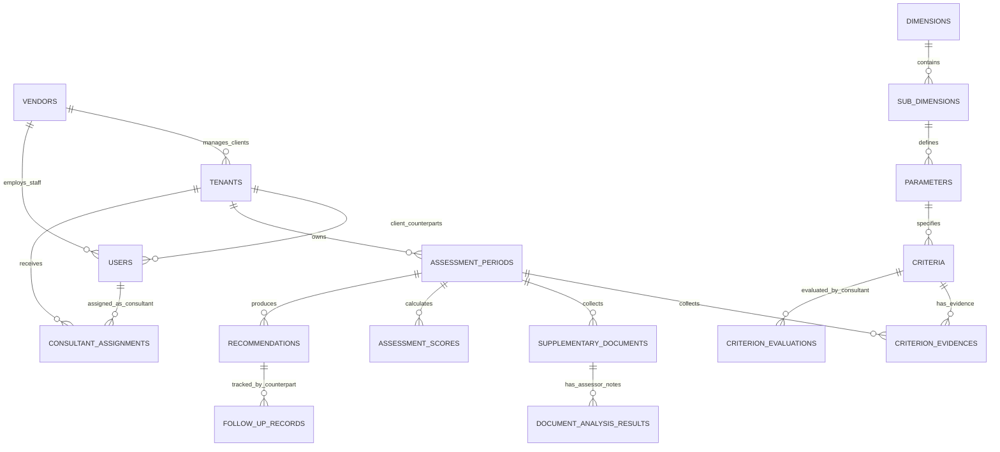
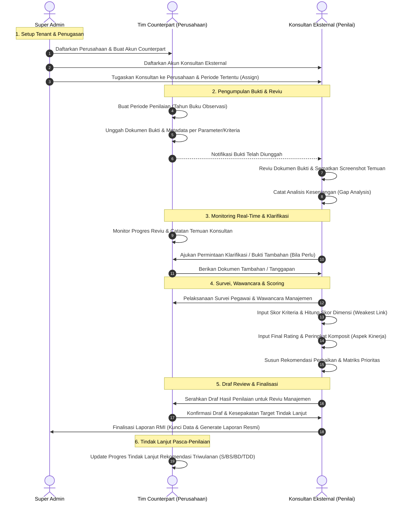

# Product Requirements Document (PRD)
# OpenRMI — Multi-Tenant Enterprise Risk Maturity Assessment & Monitoring System

---

## 1. Informasi Dokumen

| Atribut | Keterangan |
| :--- | :--- |
| **Nama Produk** | **OpenRMI** (Multi-Tenant Enterprise Risk Maturity Assessment & Monitoring System) |
| **Model Arsitektur** | **Multi-Tenant SaaS Platform** (Dapat digunakan oleh banyak perusahaan/BUMN secara independen dan terisolasi) |
| **Versi Dokumen** | 2.0.0 (Revisi RBAC & Multi-Tenancy) |
| **Status** | Approved for Development |
| **Tanggal Efektif** | 2026-09-25 |
| **Klasifikasi Dokumen** | Terbatas / Confidential |
| **Dokumen Acuan** | 1. Peraturan Menteri BUMN Nomor PER-2/MBU/03/2023 tentang Pedoman Tata Kelola dan Kegiatan Korporasi Signifikan BUMN.<br>2. Petunjuk Teknis Penilaian Tingkat Kematangan Risiko (Juknis 8 Per-2 BUMN 2023).<br>3. Modul Sertifikasi Penilaian RMI Batch II (Kementerian BUMN, Update Maret 2024).<br>4. Standar Lembar Kerja Penilaian Risiko (`SCORE RMI.xlsx`). |

---

## 2. Ringkasan Eksekutif & Visi Produk

### 2.1 Latar Belakang
Berdasarkan amanat **Peraturan Menteri BUMN No. PER-2/MBU/03/2023** dan arahan Kementerian BUMN (KBUMN), seluruh Badan Usaha Milik Negara (BUMN) dan korporasi wajib mengukur, mengelola, dan meningkatkan maturitas manajemen risikonya secara berkala melalui instrumen **Risk Maturity Index (RMI) Berbasis Kinerja**.

Penilaian RMI selama ini dilakukan menggunakan lembar kerja spreadsheet terpisah (*SCORE RMI.xlsx*). Praktik ini menimbulkan hambatan besar:
1. **Ketidakpraktisan Kolaborasi Antara Perusahaan & Konsultan**: Interaksi pengiriman bukti dukung via email/drive manual seringkali tercecer, tidak sinkron, dan membingungkan.
2. **Ketiadaan Transparansi Progres**: Tim internal perusahaan kesulitan memantau sejauh mana proses evaluasi yang sedang dikerjakan oleh konsultan eksternal.
3. **Risiko Integritas Data & Silo Bukti**: Screenshot dan dokumen penting tidak tertaut langsung ke kriteria parameter, serta rumus rawan terdistorsi (*broken formulas*).
4. **Kebutuhan Layanan Terpusat (*Multi-Company*)**: Konsultan penilai atau holding memerlukan platform tunggal yang mampu menangani banyak perusahaan (*multi-tenant*) dengan jaminan kerahasiaan data yang terisolasi total.

### 2.2 Visi & Solusi OpenRMI
**OpenRMI** adalah platform digital berbasis cloud **Multi-Tenant SaaS** yang memfasilitasi pelaksanaan asesmen RMI secara kolaboratif, transparan, dan terstandarisasi antara **Perusahaan (Tim Counterpart)** dan **Konsultan Eksternal (Penilai)** di bawah pengawasan terpusat oleh **Super Admin**.

Sistem ini mentransformasi spreadsheet manual ke dalam alur kerja digital yang efisien:
- Perusahaan (*Tim Counterpart*) dapat mengunggah bukti dokumen secara terstruktur dan memonitor setiap tahapan reviu konsultan secara *real-time*.
- *Konsultan Eksternal* dapat melakukan penilaian objektif, mencatat analisis kesenjangan (*gaps*), menyematkan screenshot bukti, mengeksekusi *scoring engine*, dan menyusun rekomendasi perbaikan.
- *Super Admin* mengelola seluruh tenant perusahaan, akun konsultan, penugasan proyek (*project assignments*), dan konfigurasi master regulasi.

---

## 3. Landasan Hukum & Regulasi

OpenRMI dirancang sepenuhnya selaras dengan ketentuan regulasi:
1. **Permen BUMN No. PER-2/MBU/03/2023**:
   - Pasal 1 angka 51: Standar Tingkat Kesehatan Korporasi menggunakan Peringkat Akhir (*Final Rating*).
   - Pengaturan Pengawasan Tata Kelola Tiga Lini (*Three Lines Model*) dan Tata Kelola Terintegrasi.
2. **Juknis Penilaian Tingkat Kematangan Risiko (Juknis 8 Per-2 BUMN 2023)**:
   - Standar 5 Dimensi, 15 Sub-Dimensi, dan 41–42 Parameter Penilaian (Umum: 42, Bank: 42, Asuransi: 41).
   - Ketentuan Penilaian Independen oleh pihak eksternal yang kompeten disertai Perjanjian Kerahasiaan (NDA).
3. **Petunjuk Teknis Pelaporan Manajemen Risiko KBUMN**:
   - Perhitungan Peringkat Komposit Risiko berbasis kombinasi Kualitas Penerapan Manajemen Risiko (KPMR - 4 parameter) dan Capaian Kinerja (3 parameter).

---

## 4. Arsitektur Multi-Tenant & Peran Pengguna (RBAC)

Platform OpenRMI menggunakan arsitektur **Multi-Tenant Shared Application, Isolated Data** di mana satu instance aplikasi dapat melayani banyak perusahaan sekaligus tanpa risiko kebocoran data antar-perusahaan.

```
┌────────────────────────────────────────────────────────────────────────┐
│                      ADMINISTRATOR (Platform Root)                     │
│   ├── Kelola Master Model Industri (Umum / Bank / Asuransi)            │
│   ├── Konfigurasi Terpusat AI Engine & Model (DeepSeek & Jina)         │
│   ├── CRUD Akun Vendor & Paket Lisensi / Langganan                     │
│   ├── Impersonate Akun Vendor (Troubleshooting & Asistensi)            │
│   └── Monitoring Kesehatan Sistem & Audit Trail Global                 │
└──────────────────────────────────┬─────────────────────────────────────┘
                                   │
                                   ▼
┌────────────────────────────────────────────────────────────────────────┐
│                       VENDOR (Penyedia Jasa Asesmen)                   │
│   ├── Kelola Portofolio Klien Perusahaan (Tenants / Organizations)     │
│   ├── Kelola Akun Tim Konsultan Eksternal / Asesor                     │
│   ├── Pengaturan Penugasan (Assign Konsultan ke Klien & Periode)       │
│   └── Monitoring Progres Seluruh Proyek Asesmen Klien                  │
└──────────────────────────────────┬─────────────────────────────────────┘
                                   │
         ┌─────────────────────────┴─────────────────────────┐
         ▼                                                   ▼
┌─────────────────────────────────┐ ┌─────────────────────────────────┐
│     TENANT KLIEN A (BUMN A)     │ │     TENANT KLIEN B (BUMN B)     │
│ ┌─────────────────────────────┐ │ │ ┌─────────────────────────────┐ │
│ │ Tim Counterpart (Internal)  │ │ │ │ Tim Counterpart (Internal)  │ │
│ │ • Upload Dokumen Bukti      │ │ │ │ • Upload Dokumen Bukti      │ │
│ │ • Upload Dokumen Tambahan   │ │ │ │ • Upload Dokumen Tambahan   │ │
│ │ • Monitoring Progres Asesor │ │ │ │ • Monitoring Progres Asesor │ │
│ └──────────────┬──────────────┘ │ │ └──────────────┬──────────────┘ │
│                │ Kolaborasi     │ │                │ Kolaborasi     │
│ ┌──────────────▼──────────────┐ │ │ ┌──────────────▼──────────────┐ │
│ │ Konsultan Eksternal         │ │ │ │ Konsultan Eksternal         │ │
│ │ • Reviu Bukti & Dokumen     │ │ │ │ • Reviu Bukti & Dokumen     │ │
│ │ • AI Help & Custom Prompt AI│ │ │ │ • AI Help & Custom Prompt AI│ │
│ │ • Input Skor & Rekomendasi  │ │ │ │ • Input Skor & Rekomendasi  │ │
│ └─────────────────────────────┘ │ │ └─────────────────────────────┘ │
└─────────────────────────────────┘ └─────────────────────────────────┘
```

### 4.1 Empat Peran Utama Sistem (Core RBAC)

| Peran (Role) | Lingkup (Scope) | Tugas & Tanggung Jawab Utama |
| :--- | :--- | :--- |
| **1. Administrator** | **Platform Owner / Root Level** | • **Pengelolaan Master Model Industri**: Menetapkan dan memelihara template regulasi (Industri Umum, Perbankan, Asuransi), bobot, dimensi, dan parameter.<br>• **Konfigurasi AI Platform**: Mengelola terpusat API Key (DeepSeek & Jina), pemilihan model aktif (`deepseek-chat` / `deepseek-reasoner`), suhu (*temperature*), dan kuota token.<br>• **Manajemen Akun Vendor**: Membuat, mengubah, mengaktifkan/menonaktifkan akun Vendor.<br>• **Fitur Impersonate Vendor**: Bertindak sebagai Vendor tertentu secara aman untuk pendampingan teknis/dukungan operasional.<br>• **Monitoring Kesehatan Sistem & Audit Global**: Memantau status server, antrean BullMQ, database PostgreSQL, Redis, penyimpanan S3, serta jejak audit lintas platform.<br>• **Manajemen Lisensi & Langganan**: Mengatur paket berlangganan, batas jumlah tenant/kuota per vendor. |
| **2. Vendor** | **Vendor Organization Level** *(Penyedia Jasa Asesmen)* | • Mendaftarkan dan mengelola profil perusahaan klien (*tenants*) di bawah portofolionya.<br>• Mengelola data pengguna konsultan eksternal (asesor) di bawah organisasinya.<br>• Melakukan penugasan (*assignment*) konsultan ke perusahaan klien dan periode penilaian tertentu.<br>• Memantau kemajuan asesmen seluruh portofolio klien secara makro.<br>• Mengelola batas kuota dan lisensi perusahaan klien yang aktif. |
| **3. Konsultan Eksternal** | **Tenant Assignment Level** *(Berdasarkan penugasan)* | • Melakukan penilaian RMI terhadap perusahaan yang ditugaskan.<br>• Memeriksa pemenuhan dokumen bukti utama dan **dokumen tambahan pasca-FGD/klarifikasi** yang diunggah Counterpart.<br>• Mengisi kolom evaluasi reviu dokumen, menyematkan kutipan penting dan screenshot bukti.<br>• Menggunakan fitur **`AI Help`** untuk rekomendasi skor kriteria otomatis.<br>• Menggunakan fitur **`AI Analisis Dokumen`** berbasis *custom prompt* (perintah bebas) untuk menganalisis dokumen tambahan, serta **melihat dan mengedit hasil analisis rahasia asesor**.<br>• Melaksanakan agenda survei dan wawancara dengan manajemen/organ perusahaan.<br>• Memberikan skor kriteria dan skor parameter berdasarkan kaidah *weakest-link*.<br>• Menghitung nilai Aspek Kinerja dan faktor penyesuaian skor.<br>• Menyusun catatan celah (*gap analysis*), rekomendasi perbaikan, dan matriks prioritas.<br>• Memfinalisasi laporan hasil penilaian RMI. |
| **4. Tim Counterpart** | **Tenant Level** *(Perusahaan Klien)* | • Mewakili entitas internal perusahaan yang sedang dinilai.<br>• Mengumpulkan dan mengunggah (*upload*) seluruh dokumen dan bukti dukung yang dipersyaratkan per parameter/kriteria.<br>• **Mengunggah Dokumen Tambahan**: Menyediakan berkas susulan yang diminta asesor setelah progress report atau sesi FGD/klarifikasi wawancara.<br>• Memberikan keterangan pendukung/metadata pada dokumen yang diserahkan.<br>• **Monitoring real-time pekerjaan konsultan eksternal**: memantau progres kelengkapan reviu, skor sementara, catatan temuan, hingga draf rekomendasi.<br>• Memberikan klarifikasi atas catatan temuan yang disampaikan konsultan.<br>• Mengonfirmasi draf laporan akhir dan memantau realisasi tindak lanjut rekomendasi perbaikan. |

---

### 4.2 Matriks Hak Akses Fitur (Permission Matrix)

| Fitur / Modul Sistem | Administrator | Vendor | Konsultan Eksternal | Tim Counterpart |
| :--- | :---: | :---: | :---: | :---: |
| **Manajemen Master Model & Regulasi** | **CRUD (Penuh)** | Read-Only | Read-Only | Read-Only |
| **Pengaturan Global AI (API Keys & Models)** | **CRUD (Penuh)** | No Access | No Access | No Access |
| **Monitoring Kesehatan Sistem (Health Check)**| **Read / Control**| No Access | No Access | No Access |
| **Audit Trail Log Global Platform** | **Full Global** | No Access | No Access | No Access |
| **Manajemen Lisensi & Langganan Vendor** | **CRUD (Penuh)** | Read (Status Sendiri)| No Access | No Access |
| **CRUD Akun Vendor** | **CRUD (Penuh)** | No Access | No Access | No Access |
| **Impersonate Akun Vendor** | **Execute** | No Access | No Access | No Access |
| **Manajemen Tenant Perusahaan Klien** | Read All | **CRUD (Portofolio)**| No Access | Read-Only (Profil Sendiri) |
| **Manajemen Akun Konsultan Eksternal** | Read All | **CRUD (Tim Sendiri)**| Read (Profil Sendiri)| No Access |
| **Penugasan Konsultan ke Tenant** | Read All | **CRUD** | Read-Only (Tugas Sendiri) | Read-Only (Melihat Asesor Ditugaskan) |
| **Pembuatan Periode Penilaian** | Read All | **CRUD** | Read-Only | Create / Read (Sesuai Tenant) |
| **Unggah Dokumen Bukti Utama (Per Parameter)**| Read-Only | Read-Only | Read-Only | **CRUD (Penuh)** |
| **Unggah Dokumen Tambahan (Pasca-FGD)** | Read-Only | Read-Only | Read-Only | **CRUD (Penuh)** |
| **Validasi & Reviu Dokumen (Review & Gap)** | Read-Only | Read-Only | **CRUD (Penuh)** | Read-Only |
| **Input Screenshot & Cuplikan Temuan** | Read-Only | Read-Only | **CRUD (Penuh)** | Read-Only |
| **Pelaksanaan Survei & Wawancara** | Read-Only | Read-Only | **Execute / Grade** | Responden / Partisipan |
| **Input Skor Kriteria & Parameter** | Read-Only | Read-Only | **CRUD (Penuh)** | Read-Only |
| **AI Assistance: Rekomendasi Nilai (AI Help)**| Read Stats | Read Stats | **Interactive Access** | No Access |
| **AI Analisis Dokumen Tambahan (Custom Prompt)**| No Access | No Access | **Execute / Query** | No Access |
| **Hasil Analisis Dokumen Asesor (Catatan Privat)**| No Access | No Access | **Lihat & Edit (Privat)** | **No Access (Tersembunyi)** |
| **Kalkulasi Aspek Kinerja & Komposit** | Read-Only | Read-Only | **CRUD (Penuh)** | Read-Only |
| **Penyusunan Rekomendasi & Matriks Prioritas**| Read-Only | Read-Only | **CRUD (Penuh)** | Read-Only |
| **Monitoring Dashboard Progres Asesor** | Read-Only | **Read Portofolio** | Read-Only (Tugas Sendiri) | **Full Interactive Access** |
| **Ekspor Laporan Resmi (PDF & Excel)** | Read | **Generate / Export** | **Generate / Export** | **Generate / Export** |
| **Input / Edit Skor RMI Tahun Sebelumnya (Baseline)**| Read-Only | Read-Only | **CRUD (Penuh)** | **CRUD (Penuh)** |
| **Perbandingan Hasil YoY (Saat Ini vs Sebelumnya)**| Read-Only | **Read-Only (Diagram Batang)** | **Full Analytics & Insights** | **Read-Only (Diagram Batang)** |
| **Perbandingan Skor Asesor vs Survei Budaya** | Read-Only | **Read-Only (Diagram Batang)** | **Full Analytics & Gap Notes** | **Read-Only (Diagram Batang)** |
| **Update Progres Tindak Lanjut Rekomendasi** | Read-Only | Read-Only | Read / Verify | **CRUD (Penuh)** |

---

## 5. Arsitektur Taksonomi & Model Penilaian

Sistem OpenRMI mendukung 3 template model penilaian industri resmi:
1. **Model KBUMN – Industri Umum (42 Parameter)**
2. **Model KBUMN – Industri Perbankan (42 Parameter)**
3. **Model KBUMN – Industri Asuransi (41 Parameter)**

### 5.1 Struktur 5 Dimensi & 15 Sub-Dimensi

```
┌────────────────────────────────────────────────────────────────────────┐
│                        MODEL PENILAIAN RMI                             │
├────────────────────────────────────────────────────────────────────────┤
│ 1. Dimensi Budaya & Kapabilitas Risiko (Param 1 - 3)                   │
│    ├── a. Budaya Risiko (Param 1)                                      │
│    └── b. Kapabilitas Risiko (Param 2 - 3)                             │
├────────────────────────────────────────────────────────────────────────┤
│ 2. Dimensi Organisasi & Tata Kelola Risiko (Param 4 - 19)              │
│    ├── a. Organ Pengelola Risiko (Param 4 - 5)                         │
│    ├── b. Peran & Tanggung Jawab Organ Pengelola Risiko (Param 6 - 12) │
│    └── c. Model Tata Kelola 3 Lini & Terintegrasi (Param 13 - 19)      │
├────────────────────────────────────────────────────────────────────────┤
│ 3. Dimensi Kerangka Risiko & Kepatuhan (Param 20 - 33)                 │
│    ├── a. Strategi Risiko (Param 20 - 26)                              │
│    ├── b. Kebijakan & Prosedur (Param 27 - 30)                         │
│    ├── c. Fungsi Kepatuhan (Param 31)                                  │
│    └── d. Efektivitas MR & Pengendalian Intern (Param 32 - 33)         │
├────────────────────────────────────────────────────────────────────────┤
│ 4. Dimensi Proses & Kontrol Risiko (Param 34 - 40)                    │
│    ├── a. Identifikasi Risiko (Param 34)                               │
│    ├── b. Pengukuran & Prioritisasi Risiko (Param 35 - 37)             │
│    ├── c. Perlakuan Risiko (Param 38 - 39)                             │
│    └── d. Pelaporan Risiko Real-time (Param 40)                        │
├────────────────────────────────────────────────────────────────────────┤
│ 5. Dimensi Model, Data, & Teknologi Risiko (Param 41 - 42)            │
│    ├── a. Permodelan & Teknologi Risiko (Param 41)                     │
│    └── b. Data Risiko (Param 42)                                       │
└────────────────────────────────────────────────────────────────────────┘
```

---

## 6. Mesin Kalkulasi & Aturan Penilaian (Scoring Engine)

### 6.1 Logika Penilaian Aspek Dimensi
1. **Skor Kriteria**: Setiap parameter memiliki serangkaian kriteria kualitatif dengan bobot skor bulat: `1, 2, 3, 4, atau 5`.
2. **Aturan Nilai Kriteria Terendah (*Weakest-Link Evaluation*)**:
   $$\text{Skor Parameter } P_i = \min(\text{Skor Kriteria } K_{i,1}, K_{i,2}, \dots, K_{i,m})$$
   *Aturan Baku:* Jika salah satu kriteria pada tingkatan tertentu belum terpenuhi, nilai parameter terkunci pada skor kriteria terendah. Skor Parameter **wajib berupa bilangan bulat (integer 1 s.d. 5)**.
3. **Skor Dimensi ($S_{D_k}$)**: Rata-rata dari seluruh parameter dalam dimensi tersebut:
   $$S_{D_k} = \frac{1}{n_k} \sum_{j=1}^{n_k} P_{k,j}$$
4. **Skor Aspek Dimensi ($S_{\text{Dimensi}}$)**: Rata-rata aritmatika dari seluruh 42 parameter (atau 41 parameter):
   $$S_{\text{Dimensi}} = \frac{1}{N} \sum_{i=1}^{N} P_i$$

---

### 6.2 Logika Penilaian Aspek Kinerja (Performance Factor)

#### A. Klausul Ambang Batas (Gating Condition)
> [!IMPORTANT]
> **Aturan Resmi:** Aspek Kinerja **HANYA dihitung jika Skor Aspek Dimensi $\ge 3.00$**.
> Jika Skor Aspek Dimensi $< 3.00$, maka:
> $$\text{Skor RMI Akhir} = S_{\text{Dimensi}}$$
> (Aspek Kinerja diabaikan, Penyesuaian Skor $= 0.00$).

#### B. Komponen Aspek Kinerja
1. **Tingkat Kesehatan Peringkat Akhir (*Final Rating*) — Bobot 50%**:
   - AAA $= 100$, AA $= 90$, A $= 79$, BBB $= 67$, BB $= 56$, B $= 44$, CCC $= 33$, CC $= 21$, C $= 10$.
2. **Peringkat Komposit Risiko — Bobot 50%**:
   - Dihitung dari kombinasi KPMR (30% Eksposur, 20% Output, 20% Biaya, 30% Ketepatan) dan Kinerja (30% KPI Kolegial, 30% Keuangan, 40% Operasi).
   - Konversi Peringkat Komposit: Peringkat 1 $= 100$, Peringkat 2 $= 78$, Peringkat 3 $= 55$, Peringkat 4 $= 33$, Peringkat 5 $= 10$.
3. **Total Skor Aspek Kinerja**:
   $$S_{\text{Kinerja}} = (K_{\text{Rating}} \times 50\%) + (K_{\text{Komposit}} \times 50\%)$$

#### C. Tabel Penyesuaian Skor Aspek Dimensi
| Skor Aspek Kinerja ($S_{\text{Kinerja}}$) | Penyesuaian Skor Dimensi ($\Delta_{\text{Kinerja}}$) |
| :---: | :---: |
| $S_{\text{Kinerja}} \le 50$ | **-1.00** |
| $50 < S_{\text{Kinerja}} \le 65$ | **-0.75** |
| $65 < S_{\text{Kinerja}} \le 80$ | **-0.50** |
| $80 < S_{\text{Kinerja}} \le 90$ | **-0.25** |
| $S_{\text{Kinerja}} > 90$ | **0.00** |

$$\text{Skor Akhir RMI} = S_{\text{Dimensi}} + \Delta_{\text{Kinerja}}$$

---

### 6.3 Spektrum Kematangan Risiko (Maturity Levels)
- **1.00 – 1.99**: Fase Awal / Fase Awal (+)
- **2.00 – 2.99**: Fase Berkembang / Fase Berkembang (+)
- **3.00 – 3.99**: Fase Praktik yang Baik / Fase Praktik yang Baik (+)
- **4.00 – 4.99**: Fase Praktik yang Lebih Baik / Fase Praktik yang Lebih Baik (+)
- **5.00**: Fase Praktik Terbaik (*Best Practice*)

---

## 7. Spesifikasi Modul Fungsional (Functional Requirements)

### Modul 1: Tata Kelola Platform, Master Model & Konfigurasi AI (Administrator)
- **FR-1.1**: Manajemen Akun Vendor (CRUD Vendor): Administrator dapat membuat akun institusi Vendor baru (nama lembaga/kantor konsultan, email admin vendor, batas kuota tenant klien, masa berlaku akun).
- **FR-1.2**: Fitur Impersonate Vendor: Administrator dapat beralih peran (*impersonate*) dan masuk ke sesi/lingkungan Vendor tertentu secara aman untuk tujuan asistensi teknis atau audit operasional, disertai banner visual "Mode Impersonate" dan pencatatan audit log secara transparan.
- **FR-1.3**: Manajemen Master Model Industri & Regulasi: Administrator mengelola template 42 parameter (Industri Umum & Perbankan) dan 41 parameter (Industri Asuransi), bobot dimensi, kriteria penilaian, dan rumus baku KBUMN.
- **FR-1.4**: Konsol Pengaturan AI Terpusat (Global AI Configuration):
  - Administrator mengelola terpusat seluruh kredensial API Key (DeepSeek API Key, Jina Embeddings API Key, MinerU API Key).
  - Opsi pemilihan model LLM DeepSeek: `deepseek-flash` (DeepSeek-V4.1-Flash untuk inferensi cepat & hemat) dan `deepseek-v4-pro` (DeepSeek-V4-Pro-0813 untuk analisis kompleks berantai).
  - Opsi *Thinking Mode* (dukungan mode *Thinking / Chain-of-Thought* aktif atau *Non-thinking mode*).
  - Opsi pemilihan model embedding: `jina-embeddings-v4` (model multimodal & multilingual termutakhir) dan `jina-embeddings-v3`.
  - Pengaturan parameter inferensi (suhu/*temperature*, *max output tokens*) dan pemantauan kuota token platform.
- **FR-1.5**: Monitoring Kesehatan Sistem & Audit Trail Global:
  - Dashboard kesehatan infrastruktur secara real-time: konektivitas database PostgreSQL 18, ketersediaan antrean BullMQ, status Redis Cache, dan latensi S3 Presigned URL.
  - Penelusuran jejak audit global (*Global Audit Trail*) untuk seluruh aktivitas transaksi dan login lintas vendor dan tenant.
- **FR-1.6**: Manajemen Lisensi & Langganan: Administrator mengatur paket lisensi, batas maksimum perusahaan klien (*tenants*) yang dapat dikelola oleh masing-masing vendor, serta masa aktif langganan.

### Modul 2: Portofolio Klien & Manajemen Konsultan (Vendor)
- **FR-2.1**: Manajemen Tenant Klien Perusahaan: Vendor mendaftarkan perusahaan klien (BUMN/Swasta) di bawah portofolionya, memilih klaster model industri, dan melengkapi profil korporasi.
- **FR-2.2**: Manajemen Pengguna Konsultan Eksternal: Vendor membuat dan mengelola akun konsultan/asesor yang bernaung di bawah lembaganya, termasuk data sertifikasi dan kontak.
- **FR-2.3**: Engine Penugasan Proyek (*Assignment Engine*): Vendor menugaskan konsultan tertentu ke perusahaan klien tertentu untuk periode penilaian tertentu dengan penetapan masa berlaku penugasan dan surat tugas/NDA.
- **FR-2.4**: Dashboard Monitoring Portofolio Klien: Vendor memantau status progres asesmen dari seluruh perusahaan klien yang ditanganinya dalam satu tampilan terpadu.
### Modul 3: Manajemen Periode Penilaian (Counterpart, Konsultan & Vendor)
- **FR-3.1**: Inisiasi Siklus Asesmen: Pembuatan tahun buku observasi (contoh: 1 Januari s.d. 31 Desember 2023) oleh Vendor atau Tim Counterpart.
- **FR-3.2**: Pengunggahan Dokumen Administrasi: Unggah SK Tim Counterpart, SK Penunjukan Penilai Independen dari Vendor, dan dokumen Pakta Integritas / NDA.
- **FR-3.3**: Workflow Status Proyek Penilaian:
  $$\text{Draft} \longrightarrow \text{Evidence Upload} \longrightarrow \text{Under Review} \longrightarrow \text{Interview/Survey} \longrightarrow \text{Scoring} \longrightarrow \text{Draft Confirmation} \longrightarrow \text{Finalized}$$

### Modul 4: Manajemen Dokumen Bukti & Pengunggahan (Tim Counterpart)
- **FR-4.1**: Checklist Kebutuhan Dokumen Terstruktur: Menyajikan daftar spesifik dokumen yang wajib disiapkan per kriteria parameter (merujuk pada standar Kolom H & I sheet *Reviu Dokumen*).
- **FR-4.2**: Multi-File Evidence Uploader: Counterpart dapat mengunggah file bukti (PDF, DOCX, XLSX, PNG, JPEG) per kriteria dengan dukungan drag-and-drop.
- **FR-4.3**: Tagging & Deskripsi Bukti: Counterpart mencantumkan nomor dokumen, tanggal pengesahan, dan keterangan letak pasal/halaman bukti.
- **FR-4.4**: Status Kelengkapan Bukti: Penanda visual status pemenuhan: *Belum Ada Bukti, Bukti Terunggah, Perlu Klarifikasi/Tambahan, Terverifikasi Konsultan*.
- **FR-4.5**: Background RAG Ingestion Pipeline (Otomatis saat Dokumen Diunggah):
  - Sistem otomatis mengekstrak dokumen teks/tabel/gambar menggunakan **MinerU** tanpa memblokir antarmuka (*asynchronous worker*).
  - Mempertahankan keutuhan halaman (*Page-Level Preservation*) tanpa pemotongan teks acak (*no arbitrary chunking*), lengkap dengan nomor halaman asli.
  - Setiap halaman diubah menjadi representasi vektor menggunakan **Jina Embeddings** (kapasitas 8.192 tokens konteks panjang).
  - Vektor dan teks halaman disimpan ke database **PostgreSQL 18 via ekstensi `pgvector`** terisolasi per tenant.
- **FR-4.6**: Modul Dokumen Tambahan (Pasca-FGD & Klarifikasi Wawancara):
  - Counterpart dapat mengunggah berkas susulan yang diminta asesor setelah penyampaian progress report atau sesi Focus Group Discussion (FGD) / klarifikasi wawancara.
  - Berbeda dari eviden per-parameter, dokumen ini memiliki klasifikasi: *Tindak Lanjut FGD, Klarifikasi Wawancara, Dokumen Ad-Hoc*.
  - Dokumen tambahan otomatis diproses oleh pipeline MinerU dan Jina agar siap dianalisis secara cerdas oleh konsultan.

### Modul 5: Reviu Bukti, Temuan & Screenshot (Konsultan Eksternal)
- **FR-5.1**: Workspace Reviu Asesor: Tampilan terintegrasi antara dokumen bukti yang diunggah counterpart dengan lembar evaluasi kriteria parameter.
- **FR-5.2**: Cuplikan Bukti & Screenshot Embedder: Konsultan dapat mengunggah dan menyematkan cuplikan/screenshot dokumen atau sistem pendukung langsung pada baris kriteria (menggantikan Kolom L sheet *Reviu Dokumen*).
- **FR-5.3**: Catatan Reviu Dokumen & Analisis Kesenjangan: Konsultan menginput narasi evaluasi kepatuhan dan gap temuan secara langsung (Kolom J sheet *Reviu Dokumen*).
- **FR-5.4**: Permintaan Klarifikasi Bukti: Konsultan dapat memberikan tanda catatan (*flag notes*) jika dokumen yang diunggah counterpart belum memadai.
- **FR-5.5**: Fitur AI Assistance & Scoring Recommendation (*Khusus Asesor/Konsultan Eksternal*):
  - **Aksi `AI Help` per Parameter**: Tombol interaktif di setiap parameter untuk meminta analisis cerdas AI terhadap dokumen bukti yang telah diunggah.
  - **Core Reasoning DeepSeek (LLM)**: Menganalisis potongan konteks relevan dari database vektor (`pgvector`), membandingkan dokumen bukti terhadap standar kriteria Juknis KBUMN, dan mendeteksi kesenjangan (*gap analysis*).
  - **Output Rekomendasi Terperinci**:
    1. Rekomendasi nilai skor (1 s.d. 5) untuk setiap kriteria dalam parameter.
    2. Rekomendasi skor parameter terhitung otomatis (*weakest-link*).
    3. Referensi presisi: **Nomor Halaman** dokumen dan **Kutipan Verbatim Eviden** (*exact evidence quote*) yang mendasari rekomendasi skor.
    4. Narasi justifikasi evaluasi dokumen untuk catatan reviu.
  - **One-Click Apply (*Terapkan Nilai & Bukti*)**: Asesor dapat meninjau rekomendasi AI dan menerapkan nilai skor beserta kutipan ke lembar kerja penilaian hanya dengan satu kali klik. Tetap berlaku asas *Human-in-the-Loop* di mana konsultan dapat mengedit sebelum konfirmasi.
- **FR-5.6**: Fitur AI Analisis Dokumen Tambahan Berbasis Perintah Bebas (*Custom Prompt*):
  - Asesor dapat membuka daftar dokumen tambahan yang diunggah Counterpart dan memberikan *custom prompt* (perintah bebas) sesuai kebutuhan asesmen (contoh: *"Analisis apakah SOP ini sudah mengatur eskalasi limit risiko ke Direksi?"*, *"Ekstrak temuan audit yang belum diselesaikan pada notulen ini"*).
  - AI DeepSeek membaca dokumen terkait secara utuh via konteks RAG dan memberikan jawaban terstruktur.
  - **Penyimpanan & Hak Akses Privat Asesor**: Hasil analisis disimpan langsung pada record dokumen terkait. **Hasil ini HANYA dapat dilihat dan diedit oleh Konsultan Eksternal** (bersifat rahasia/internal asesor dan tersembunyi dari Tim Counterpart). Asesor dapat menyunting/memperbaiki catatan analisis tersebut sebelum dijadikan kesimpulan akhir.

### Modul 6: Modul Survei & Wawancara (Konsultan Eksternal & Counterpart)
- **FR-6.1**: Survei Budaya Risiko Terpadu (Akses Publik Tanpa Login):
  - Sistem menghasilkan tautan unik bertoken (*Public Token URL*) dan QR Code untuk pengisian kuesioner skala Likert (1–5) secara mandiri dan mobile-friendly tanpa mengharuskan partisipan membuat akun/login password.
  - Menjamin anonimitas penuh responden untuk mendorong kejujuran penilaian kesadaran risiko karyawan.
  - Mengumpulkan data demografi agregat (Direktorat/Divisi, Jenjang Jabatan, Masa Kerja) dan menghasilkan agregasi skor persepsi budaya risiko secara otomatis.
- **FR-6.2**: Manajemen Sesi Wawancara: Pencatatan agenda wawancara terstruktur dengan Direksi, Dekom/Dewas, Komite Pemantau Risiko, Lini 2, dan Lini 3 SPI.
- **FR-6.3**: Notulensi & Validasi Wawancara: Konsultan mencatat temuan wawancara yang dikonfirmasi silang dengan dokumen kebijakan.

### Modul 7: Scoring Engine, Data Historis & Analisis Komparatif (Konsultan Eksternal)
- **FR-7.1**: Lembar Penilaian Aspek Dimensi Otomatis: Konsultan menginput skor kriteria (1–5), dan sistem secara otomatis menghitung:
  - Skor Parameter (aturan kriteria terendah / integer 1–5).
  - Skor Dimensi (rata-rata parameter per dimensi).
  - Skor Aspek Dimensi (rata-rata seluruh 42 parameter).
- **FR-7.2**: Lembar Kalkulasi Aspek Kinerja:
  - Konsultan memilih Tingkat Kesehatan Final Rating $\rightarrow$ auto konversi skor.
  - Konsultan menginput Peringkat Komposit Risiko $\rightarrow$ auto konversi skor.
  - Sistem otomatis memeriksa syarat kelayakan ($S_{\text{Dimensi}} \ge 3.00$) dan menetapkan faktor penyesuaian skor.
- **FR-7.3**: Lembar Ringkasan Skor RMI: Komputasi akhir nilai RMI lengkap dengan penentuan fase kematangan (Awal s.d. Praktik Terbaik).
- **FR-7.4**: Input Data Penilaian RMI Tahun Sebelumnya (Baseline Historis - Opsional):
  - Sistem menyediakan fitur opsional untuk menginput data penilaian tahun buku sebelumnya sebagai garis dasar (*baseline*).
  - **Hak Akses Input & Edit Ganda**: Baik **Konsultan Eksternal** maupun **Responden / Tim Counterpart** dapat mengisi dan mengedit nilai historis ini.
  - Cakupan data:
    1. Skor Aspek Dimensi dan Skor 5 Dimensi tahun lalu.
    2. Skor Aspek Kinerja, Skor Komposit, dan Skor Akhir RMI beserta Fase Kematangan tahun lalu.
    3. Skor 42 Parameter tahun lalu (opsional, jika korporasi memiliki rekam jejak parameter granular).
- **FR-7.5**: Fitur Analisis Perbandingan YoY (Year-on-Year: Periode Saat Ini vs Tahun Sebelumnya):
  - Menghitung delta perubahan capaian ($\Delta = S_{\text{Saat Ini}} - S_{\text{Tahun Lalu}}$) pada level Skor Akhir RMI, 5 Dimensi, dan Parameter.
  - **Visualisasi Diagram Batang Komparatif (*Grouped Bar Chart*)**: Menampilkan perbandingan batang berdampingan antara *Tahun Berjalan* dan *Tahun Sebelumnya* lengkap dengan indikator kenaikan/penurunan.
  - **Hak Akses Terkendali**: Konsultan memiliki hak analitik mendalam dan penyusunan narasi komparasi; **Vendor dan Tim Counterpart hanya dapat melihat (*Read-Only*)** diagram batang dan metrik perbandingan di dashboard mereka.
- **FR-7.6**: Fitur Analisis Perbandingan Skor Asesor vs Skor Survei Budaya (*Perception Gap Analysis*):
  - Mengomparasikan skor objektif hasil reviu dokumen bukti oleh Asesor pada Parameter 1 (Budaya Risiko) dan Dimensi 1 dengan skor rata-rata persepsi survei karyawan.
  - Menghitung kesenjangan persepsi: $\Delta_{\text{Persepsi}} = S_{\text{Survei}} - S_{\text{Asesor}}$.
  - Mengidentifikasi zona *Overconfidence* (persepsi karyawan jauh lebih tinggi dari bukti nyata) atau *Underestimation*.
  - **Visualisasi Diagram Batang Komparatif (*Side-by-Side Bar Chart*)**: Menampilkan batang Skor Asesor vs Skor Hasil Survei Pegawai.
  - **Hak Akses Terkendali**: Konsultan memiliki hak analisis penuh; **Vendor dan Tim Counterpart hanya dapat melihat (*Read-Only*)** diagram batang komparatif tersebut.

### Modul 8: Rekomendasi Perbaikan & Matriks Prioritas (Konsultan Eksternal)
- **FR-8.1**: Format Tabel Rekomendasi Standar KBUMN: Mengisi kolom baku: *Rekomendasi, Kode Parameter, Jadwal Penyelesaian, Aktivitas Utama, Output, Indikator Keberhasilan, Unit In Charge (UIC), Penjelasan Tujuan & Nilai Tambah*.
- **FR-8.2**: Matriks Prioritas 2x2 Otomatis:
  - Kuadran I: Dampak Tinggi & Implementasi Mudah (Prioritas Pertama).
  - Kuadran II: Dampak Rendah & Implementasi Mudah / Dampak Tinggi & Implementasi Sulit (Prioritas Kedua).
  - Kuadran III: Dampak Rendah & Implementasi Sulit (Prioritas Ketiga).
- **FR-8.3**: Horizon Waktu Rencana Aksi: Pengelompokan rekomendasi jangka pendek ($< 1$ tahun) dan jangka panjang ($> 1$ tahun).

### Modul 9: Dashboard Monitoring Pekerjaan Konsultan (Tim Counterpart & Vendor)
- **FR-9.1**: Real-Time Progress Bar: Counterpart dan Vendor dapat melihat persentase dokumen yang telah direviu oleh konsultan, status wawancara, dan tahapan asesmen yang sedang berjalan.
- **FR-9.2**: Transparansi Draf Penilaian: Counterpart dapat melihat draf skor per dimensi secara transparan beserta catatan temuan gap yang dicatat oleh konsultan.
- **FR-9.3**: Klarifikasi & Tanggapan Draf: Counterpart dapat memberikan respon atau mengunggah bukti tambahan sebelum draf laporan difinalisasi.
- **FR-9.4**: Konfirmasi Hasil Akhir: Fitur konfirmasi resmi draf laporan oleh Tim Counterpart dan Direksi sebelum diterbitkan menjadi laporan final.

### Modul 10: Pelaporan Resmi, Ekspor & Tindak Lanjut Pasca-Asesmen
- **FR-10.1**: Format Formulir Resmi Ringkasan Hasil (Format 1.2.8): Halaman cetak resmi berisi profil BUMN, nomor laporan, rekapitulasi 5 dimensi, aspek kinerja, dan skor RMI akhir.
- **FR-10.2**: Ekspor Laporan Kompatibel: Ekspor laporan final ke PDF berstempel resmi dan ekspor data ke file Microsoft Excel (`SCORE RMI.xlsx`) yang terisi otomatis.
- **FR-10.3**: Pemantauan Tindak Lanjut Triwulanan (Format 1.2.9): Tim Counterpart memperbarui status tindak lanjut rekomendasi dengan kategori: `S` (Sesuai), `BS` (Belum Sesuai), `BD` (Belum Ditindaklanjuti), `TDD` (Tidak Dapat Ditindaklanjuti).

---

## 8. Kebutuhan Non-Fungsional (NFR)

### 8.1 Multi-Tenant Data Isolation & Security
- **NFR-SEC-1**: Isolasi data ketat berbasis Vendor ID dan Tenant ID pada seluruh tabel basis data (*Row-Level Security / Schema Isolation*). Tidak ada kebocoran data antar-vendor dan antar-perusahaan klien.
- **NFR-SEC-2**: Enkripsi penuh dokumen bukti korporasi menggunakan AES-256 pada media penyimpanan dan TLS 1.3 pada transmisi data.
- **NFR-SEC-3**: Konsultan eksternal hanya memiliki akses baca/tulis terhadap perusahaan yang secara sah ditugaskan oleh Vendor lembaganya.
- **NFR-SEC-4**: Fitur Impersonate Vendor oleh Administrator wajib menggunakan token otorisasi sementara bervalidasi ganda, memunculkan notifikasi/banner visual "Impersonation Mode", serta tercatat secara permanen pada tabel audit log (`impersonated_by_admin_id`).

### 8.2 Audit Trail & Integritas Penilaian
- **NFR-AUD-1**: Seluruh riwayat pengunggahan bukti, revisi skor kriteria, catatan temuan, impersonasi vendor, dan perubahan status tercatat dalam log audit yang tidak dapat diubah (*immutable audit trail*).
- **NFR-AUD-2**: Laporan yang telah berstatus *Finalized* terkunci secara permanen untuk menjaga integritas data penilaian.

### 8.3 Kinerja & Aksesibilitas Sistem
- **NFR-PERF-1**: Response time rendering workspace penilaian $\le 1.5$ detik.
- **NFR-PERF-2**: Dukungan upload file dokumen bukti hingga ukuran 100 MB per berkas.
- **NFR-PERF-3**: Ketersediaan sistem (*Uptime SLA*) minimal 99.9%.

---

## 9. Desain Skema Data Multi-Tenant (Entity-Relationship Overview)



### Entitas Kunci:
1. `vendors`: Menyimpan identitas lembaga penyedia jasa/kantor konsultan, kuota tenant klien, paket lisensi/langganan, dan status aktif.
2. `tenants`: Menyimpan identitas perusahaan klien (BUMN/Swasta), kode entitas, klaster industri (*Umum / Bank / Asuransi*), logo, dan referensi `vendor_id`.
3. `users`: Akun pengguna sistem dengan atribut `role` (`ADMINISTRATOR`, `VENDOR`, `EXTERNAL_CONSULTANT`, `COUNTERPART_TEAM`), `vendor_id`, dan `tenant_id`.
4. `consultant_assignments`: Menghubungkan user `EXTERNAL_CONSULTANT` dengan `tenant_id` tertentu untuk `assessment_period_id` tertentu, dilengkapi tanggal mulai/selesai penugasan dan surat tugas/NDA.
4. `assessment_periods`: Tahun buku observasi per tenant (contoh: TB 2023), model industri yang diterapkan, dan status tahapan asesmen.
5. `criterion_evidences`: Dokumen bukti yang diunggah oleh `COUNTERPART_TEAM` (nama file, URL storage, nomor dokumen, tanggal berlaku, keterangan).
6. `criterion_evaluations`: Hasil penilaian oleh `EXTERNAL_CONSULTANT` (skor kriteria 1–5, catatan reviu dokumen, screenshot bukti temuan, catatan wawancara).
7. `parameter_scores`: Skor agregat parameter hasil perhitungan terendah kriteria (*weakest link rule*).
8. `performance_scores`: Input Final Rating, Peringkat Komposit Risiko, dan hasil kalkulasi penyesuaian skor.
9. `recommendations`: Daftar rencana aksi rekomendasi konsultan lengkap dengan parameter terkait, timeline, UIC, dan kuadran prioritas.
10. `follow_up_records`: Progres tindak lanjut rekomendasi triwulanan yang diisi oleh `COUNTERPART_TEAM` (status S/BS/BD/TDD dan bukti implementasi).

---

## 10. Alur Kerja Siklus Hidup Penilaian Kolaboratif



---

## 11. Rencana Roadmap Pengembangan

| Fase | Target Waktu | Fokus Pengembangan | Hasil Utama (*Deliverables*) |
| :--- | :--- | :--- | :--- |
| **Fase 1: Multi-Tenant Core & Digitalized Excel (MVP)** | Bulan 1 – 2 | • Arsitektur Multi-Tenant dasar (Isolasi data).<br>• 3 Role RBAC: Super Admin, Konsultan Eksternal, Tim Counterpart.<br>• Modul unggah bukti dukung oleh Counterpart.<br>• Workspace reviu dokumen & scoring engine oleh Konsultan.<br>• Dashboard monitoring progres kerja konsultan untuk Counterpart.<br>• Ekspor laporan standar RMI. | Platform kolaborasi asesmen RMI multi-perusahaan siap operasional (*MVP*). |
| **Fase 2: Complete Scoring & Evidence Tools** | Bulan 3 – 4 | • Engine screenshot embedder & annotasi dokumen.<br>• Modul survei budaya risiko & agenda wawancara.<br>• Modul kalkulasi Aspek Kinerja & Komposit terintegrasi.<br>• Template industri Perbankan & Asuransi. | Fitur penilaian komprehensif 100% selaras modul KBUMN. |
| **Fase 3: Recommendation Engine & Action Tracker** | Bulan 5 – 6 | • Generator matriks prioritas 2x2 otomatis.<br>• Modul monitoring tindak lanjut triwulanan (*S, BS, BD, TDD*).<br>• Notifikasi email penugasan & reminder jatuh tempo.<br>• Sinkronisasi ekspor/impor langsung ke file `SCORE RMI.xlsx`. | Sistem siklus penuh asesmen hingga pemantauan rencana aksi. |
| **Fase 4: Executive Insights & Portfolio Analytics** | Bulan 7 – 8 | • Dashboard analitik portofolio bagi holding atau konsultan dengan banyak klien.<br>• Benchmarking maturitas risiko antar-perusahaan (anonymized).<br>• AI-assisted document parser untuk verifikasi awal kelengkapan bukti. | Platform intelligence & enterprise risk management tingkat lanjut. |

---

## 12. Kriteria Keberhasilan Produk (Success Metrics / KPIs)

1. **Efektivitas Kolaborasi**: Seluruh proses pengumpulan bukti oleh Counterpart dan penilaian oleh Konsultan berlangsung dalam platform tanpa pertukaran spreadsheet terpisah.
2. **Transparansi Pekerjaan (100% Visibility)**: Tim Counterpart dapat memantau progres tahapan, status reviu dokumen, dan draf temuan konsultan secara *real-time*.
3. **Integritas Kalkulasi & Regulasi (100% Compliance)**: Perhitungan nilai dimensi, aturan kriteria terendah (*weakest-link*), dan formula aspek kinerja menghasilkan nilai yang 100% akurat sesuai modul resmi KBUMN.
4. **Isolasi Data Sempurna (Zero Data Leakage)**: Tidak ada kebocoran data antar-tenant perusahaan pada seluruh endpoint API dan query database.

---
*Dokumen PRD ini telah direvisi secara resmi untuk menetapkan arsitektur Multi-Tenant dan 3 peran utama (Super Admin, Konsultan Eksternal, Tim Counterpart).*
